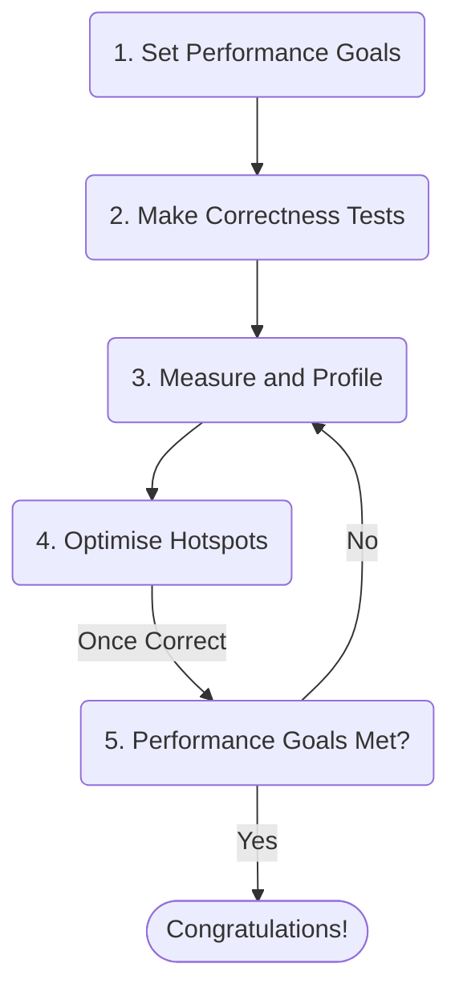
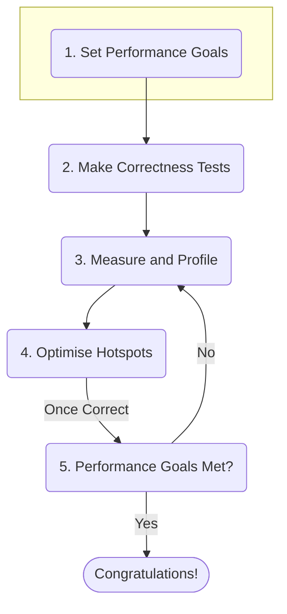
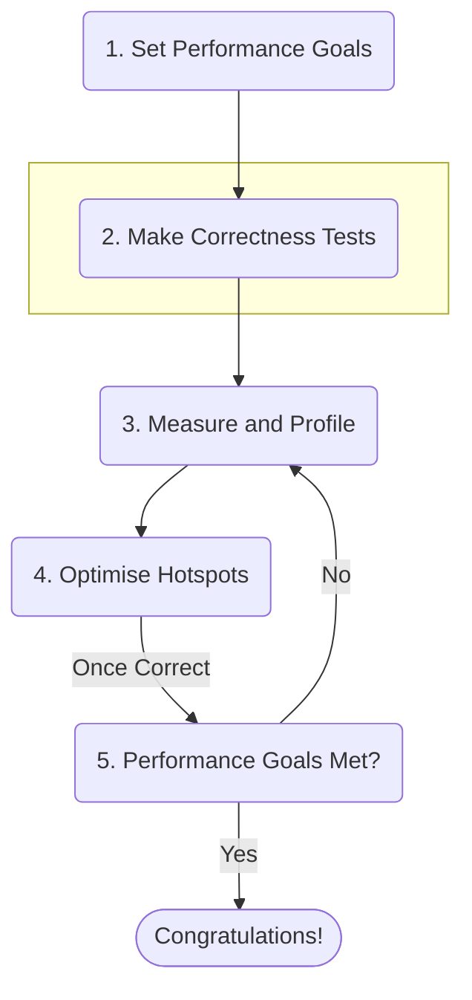
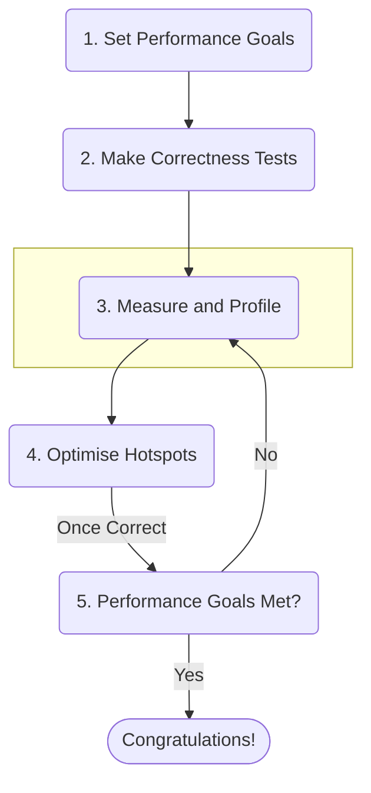
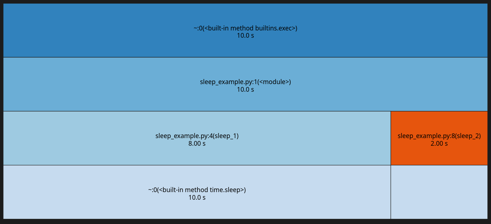
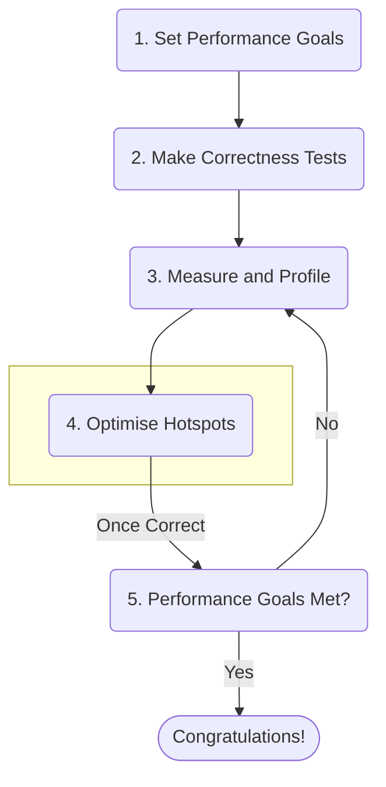
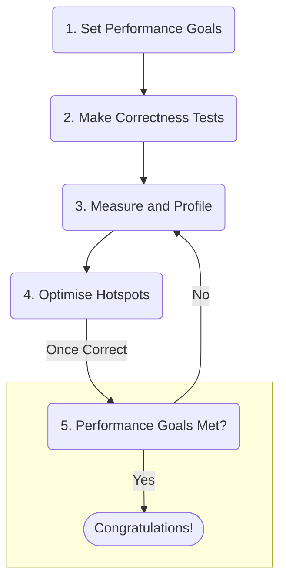

# A Beginner's Guide to Optimisation

---
layout: side-title
color: lime
---

:: title ::

## My Personal Approach To Optimisation:

:: content ::



---
layout: top-title-two-cols
color: lime
columns: is-8
---

:: title ::

## Step 1: Set Performance Goals

:: left ::

**Why are you optimising your code?**
- So that you can meet your deadlines?
- So you can run more simulations/analysis?

**Set a concrete target:**
- ~~I want my code to run 300x faster~~
- It would be great if this script was <20 minutes

<br>

**Make sure your goal is achievable!**

**Just because you can 300x one ideal function, doesn't mean you can for your whole codebase!** 

:: right ::



---
layout: top-title-two-cols
color: lime
columns: is-8
---

:: title ::

## Step 2: Make Correctness Tests

:: left ::

**Correctness > Speed, Always:**
- Optimisation = changing your code
- If you can't check it's still correct, you'll have a bad time
- Unit tests are ideal, but often not available
- At least make some end-to-end runs with **known good input/outputs** to compare to!

<br>

<Admonition title="Floating Point Numbers Aren't Real!" color="amber-light" width="100%">
Optimised code may not give exactly the same results, but that doesn't mean it's wrong!

`np.testing.assert_all_close` (and the rest of `numpy.testing`) is your new best friend
</Admonition>

:: right ::


---
layout: top-title-two-cols
color: lime
columns: is-8
---

:: title ::

## Step 3: Measure and Profile

:: left ::

**Before you can speed things up, you need to know what's slowing things down:**
- You can't guess this, you need to **measure**
- Use a **profiler** to find which functions (or even which lines) are slowing you down!
- For this, you need a representative run:
  - Your unit tests will not make good performance tests!
  - You need a few end-to-end tests with realistic input sizes to properly profile your code

:: right ::


---
layout: top-title-two-cols
color: lime
columns: is-8
---

:: title ::

## Step 3: Measure and Profile - Prioritise!

:: left ::

**Don't waste your time on the small gains:**
- When profiling, **percentage of total runtime** is the only thing that matters
- If a function only takes 5% of your runtime, you can optimise it 1,000,000x and still only save <5% of your runtime
- Always start with the biggest chunk of your runtime!

<br>

<Admonition title="A Bit More Formally: Amdahl's Law" color="amber-light" width="100%">

Speedup of the whole program, $S_{tot}$, is determined by speedup of individual process, $S_{proc}$, and the fraction of the runtime that process takes, $f_{proc}$:

### $S_{tot} = \frac{1}{(1-f_{proc}) + \frac{f_{proc}}{S_{proc}}}$ 

</Admonition>

:: right ::



---
layout: top-title
color: lime
---

:: title ::

## Aside: Profilers for Python

:: content ::

There are a **huge** number of profilers for Python

Personally, I'd recommend starting with the basics:
  - `CProfile` (built-in) 
    - Perfect for identifying **hot functions**
    - Combine with `SnakeViz` (pip install) to visualise text output as a graph
  - `line_profiler` (pip install)
    - Great when you need a bit more detail on a function
    - Ideally your functions are small enough not to need this!
- `%timeit` (one line) and `%%timeit` (whole cell) in Jupyter notebooks are a great starting point!
  - Perfect for direct comparisons of small functions (as we'll use in the exercises)

---
layout: top-title-two-cols
color: lime
columns: is-5
---

:: title ::

## Aside: Profilers for Python (Example)

:: left ::

sleep_example.py

```python
from time import sleep

def sleep_1():
  sleep(1) # Pause code for 1 second

def sleep_2():
  sleep(2) # Pause code for 2 seconds

for i in range(8):
  sleep_1() # Called 8 times

sleep_2() # Called once
```

Profile with:
```sh
# First run CProfile (can be done in code, instead)
python3 -m cProfile -o profile.out sleep_example.py

# Then use SnakeViz to visualise the output
snakeviz profile.out
```

:: right ::

`SnakeViz` Output:



Slowest individual function is `sleep_2` (in red)

But, `sleep_1` (the widest function) is killing our runtime (8s vs 2s)

**Always start with the widest function! `sleep_1` is the real culprit here!**

---
layout: top-title-two-cols
color: lime
columns: is-8
---

:: title ::

## Step 4: Optimise Hotspots

:: left ::

We've found the slow part of the code, it's time to make it go faster!

There are two key approaches:
- **Algorithm/data structure improvements:**
  - Always where the real time saves come from!
  - e.g. moving from naive search to binary search
- **Numerical/code optimisation (today's topic):**
  - Offloading to optimised libraries like `NumPy`, `SciPy`, etc...
  - Manually optimising the code (cough, cough - `Numba`!)


<Admonition title="Don't Forget to Test!" color="red-light" width="100%">

**It's only an optimisation if it's still correct, test after each change!**

</Admonition>

:: right ::



---
layout: top-title-two-cols
color: lime
columns: is-8
---

:: title ::

## Step 5: Check if You're Finished!

:: left ::

After each function/major line optimisation, check two things:
- Is my code still correct?
  - Remember, `np.testing.assert_all_close` is your friend!
- Have I met my performance goal?
  - It's important to know when to stop!
  - Diminishing returns exist, at some point it's not worth more of your dev time

If you're not finished, profile your code again, identify the hotspots, and get back to it!

:: right ::



---
layout: side-title
color: lime
---

:: title ::

## Section Summary

:: content ::

### In this section we have learnt:

- To set realistic performance targets
- To **always** make sure we have some kind of correctness test before optimising
- To **always** measure and profile before optimising
- To know when to stop

---
layout: top-title
color: lime
---

:: title ::

## So We've Got a Process, Now What?

:: content ::

So far, we've learnt:
- Why Python is slow (because it's a **dynamic, interpreted** language that favours readability)
- How we can go about identifying areas in need of optimisation, and what that process looks like

As this is the **CERN** Inverted School of Computing, I'm willing to bet most of your slow code is numerical in nature:
- Data analysis
- Simulations
- Heavy calculations

So, let's cover two great ways to optimise numerical code - **NumPy and Numba!**
