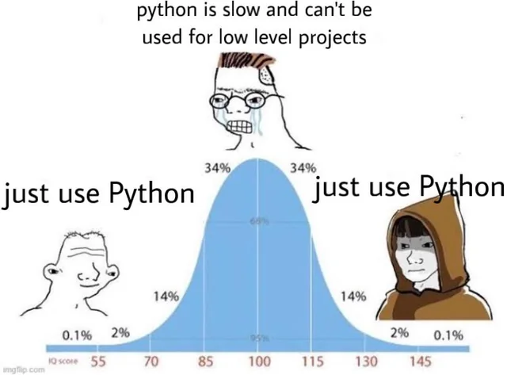

# Some Final Words of Advice

---
layout: side-title
color: sky
---

:: title ::

## We've Covered LOADS Today

:: content ::

<Toc minDepth="1" maxDepth="1" />

---
layout: top-title
color: sky
---

:: title ::

## Sadly I Couldn't Cover It All, So Here's Some Homework

:: content ::

<v-click>

Some further reading/watching:

</v-click>

<v-clicks>

- Sten Astrand's iCSC2025 Talk "Under the Hood of the Snake: Behind the scenes of Python"
- This Book on Python's internals
- This very comprehensive NumPy tutorial
- Numba's Amazing Documentation
- Numba's Own List of Talks
  - This One is My Personal Favourite

</v-clicks>

---
layout: top-title-two-cols
color: sky
columns: is-7
---

:: title ::

## If You Remember Anything From Today, I Hope It's This

:: left ::

<v-clicks>

- Python is a completely valid option for scientific workflows
- Pure Python can be slow, but yours doesn't have to be 
  - Just make sure you know what's happening under the hood of your Python!
- NumPy will give you all the performance you need 99% of the time
- And in that other 1%, tools like Numba are a great choice
- Be careful with parallel compute, and only use it when you need it!

</v-clicks>

:: right ::

<v-click at=2>

</v-click>

<v-click>

And finally, most importantly:

</v-click>

<v-click>

### **Always Measure Before Optimising and Make Sure You Test Your New Code!**

</v-click>

