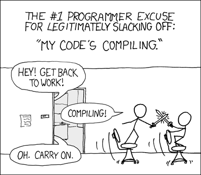
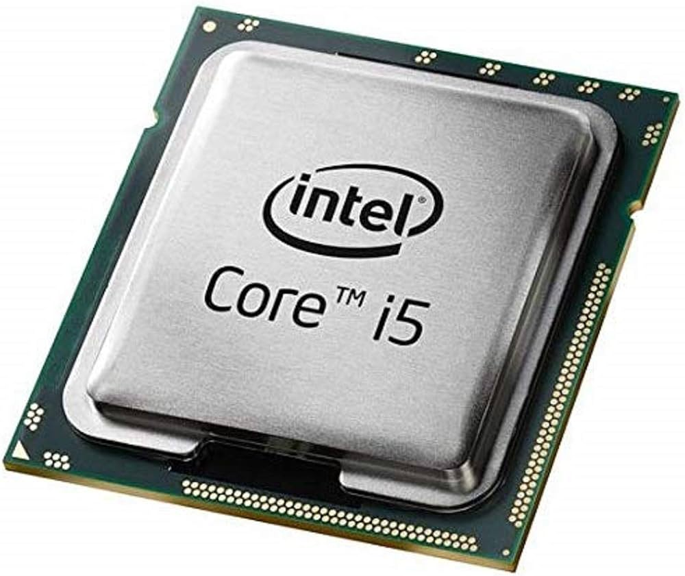
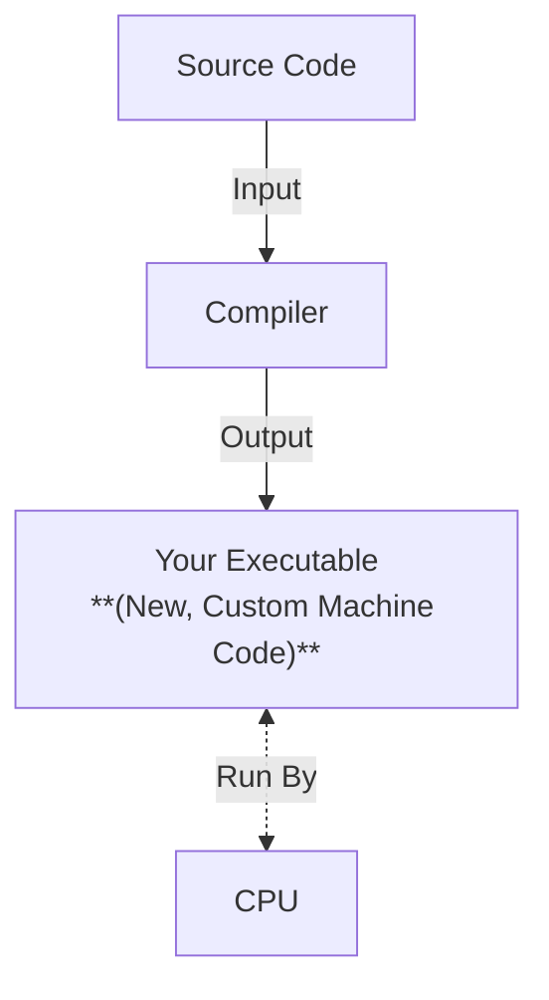
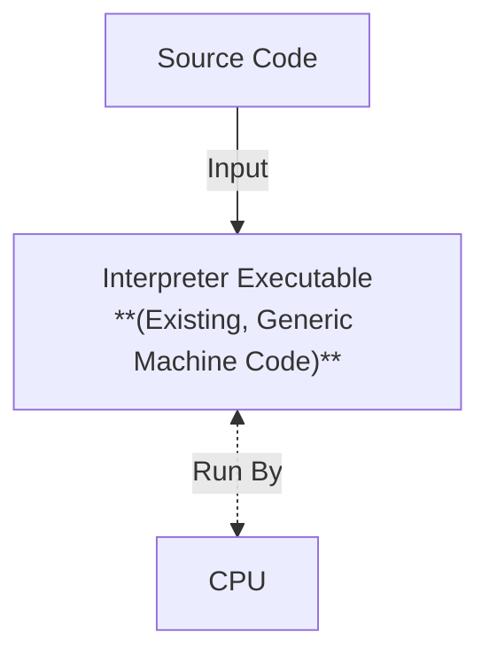
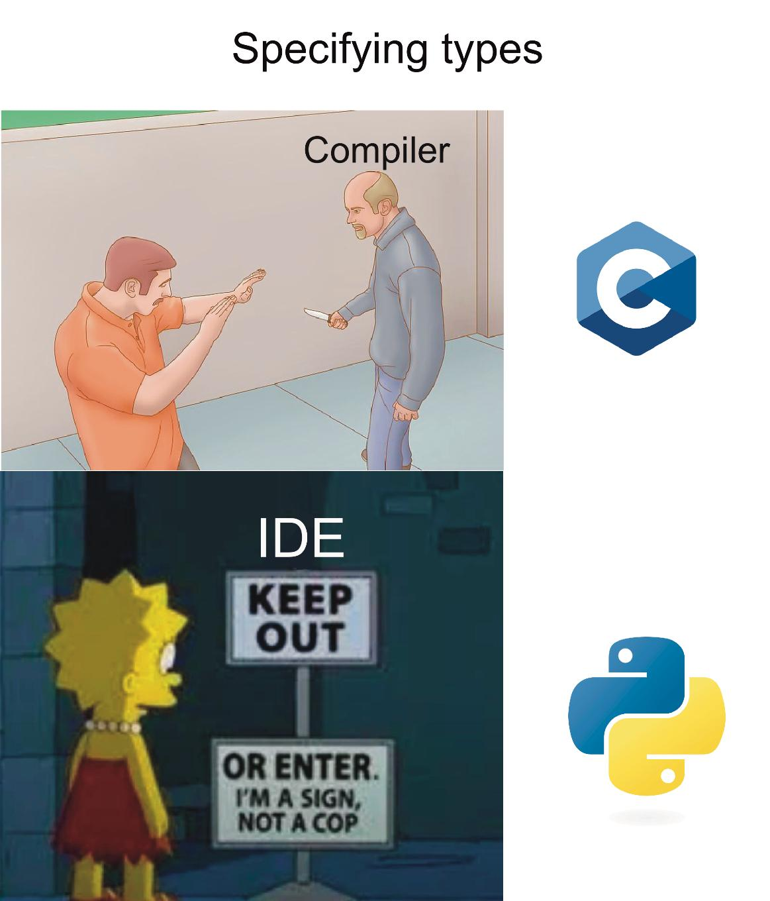
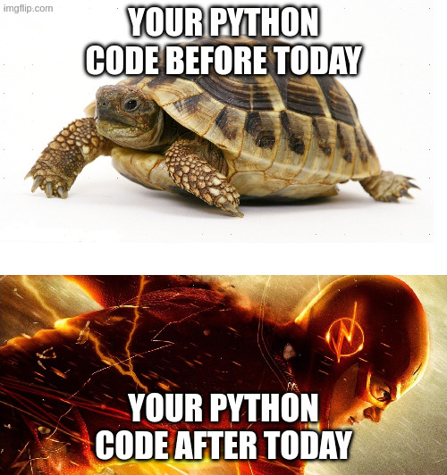

# Why is Python Slow? Compiled, Interpreted and Other Jargon

---
layout: quote
color: orange
author: ChatGPT
---

Python is often considered slow because it is an **interpreted, dynamically typed** language that prioritizes readability and flexibility over raw execution speed, adding runtime overhead compared to **compiled languages**.

---
layout: side-title
color: orange
---

:: title ::

## Why Python is Slow Part 1:

## Compiled vs Interpreted

:: content ::



---
layout: top-title-two-cols
color: orange
---

:: title ::

## From Source Code to Calculation: How Computers Work

:: left ::

<v-click at=2>

<SpeechBubble position="bl" color="sky" shape="round" maxWidth="100%">

I'm a programmer, and I speak **source code**

```python
def hello_world():
  print("Hello iCSC26!")
```

</SpeechBubble>


</v-click>

<br>

<v-click at=1>

### Programming languages all ultimately try to solve the same problem

</v-click>

:: right ::

<v-click at=3>

<SpeechBubble position="bl" color="sky" shape="round" maxWidth="100%">

I'm a CPU, and I speak **machine code**

```sh
01010101010101010101010101011010
10101010101001010111010101010101
```

</SpeechBubble>



</v-click>

<br>

<v-click at=4>

<Admonition title="Watch Out!" color="amber-light" width="100%">

There is no single machine code, the language depends on your specific CPU (x86/ARM/etc...) and your OS (Windows/Linux/Mac)

</Admonition>

</v-click>


---
layout: top-title-two-cols
color: orange
columns: is-7
---

:: title ::

## Approach 1: Compiled Languages

:: left ::

<v-click at=1>

The general idea is as follows:

- **Compilers** take in **source code** as an input, and output new **executables** filled with the **machine code** you want

</v-click>


<v-click at=2>

In practice:

```bash
# Use compiler (g++) once to create your own executable (my_exec)
g++ my_code.cpp -o my_exec

# Run you machine code executable as many times as you want!
./my_exec
- Hello iCSC!
./my_exec
- Hello iCSC!
```

</v-click>

<v-click at=3>

Common examples of compiled languages are C, C++, Rust, and Fortran

</v-click>

:: right ::

<v-click at=1>



</v-click>

---
layout: top-title-two-cols
color: orange
columns: is-7
---

:: title ::

## Approach 2: Interpreted Languages

:: left ::

<v-click at=1>

The general idea is as follows:

- Instead of the language having a **compiler**, it will have an **executable** known as the **interpreter**
- The **interpreter** essentially reads your code "line-by-line", understands what you're trying to do, and asks the CPU to perform the relevant operation

</v-click>


<v-click at=2>

In practice:
```bash
# No compilation step, just give the interpreter your script!
python my_script.py
- Hello iCSC!
python my_script.py
- Hello iCSC!
# `python` is the executable that your CPU can actually run!
```

</v-click>

<v-click at=3>

Common examples of interpreted languages are Python, Bash, Ruby, and Perl

</v-click>

:: right ::

<v-click at=1>



</v-click>

---
layout: top-title-two-cols
color: orange
---

:: title ::

## So, Why Are Compiled Languages Faster?

:: left ::

<v-click>

Compiled languages are faster for two main reasons:

</v-click>

<v-click>

- Less runtime overheads
  - They don't need to repeat compiler-like steps (e.g. understanding the source code)

</v-click>

<v-click>

- Compilers can perform optimisations
  - Since they generate **new, custom** machine code for your program, they can make sure it's optimised for your use case
  - Modern compiler optimisations are aggressive, they will change their code as much as they can without changing the result/behaviour

</v-click>

:: right ::

<v-click>

Compilers are written by incredibly talented performance engineers who have intimate knowledge of a CPU's instruction set

</v-click>

<v-click>

Compilers can perform all kinds of optimisations, including:
- Computing compile-time constants
- Loop optimisations
- Memory and cache optimisations
- Control flow and function optimisations
- <Link to="compiler-optimisations" title="So, so much more" />

</v-click>

---
layout: top-title-two-cols
color: orange
---

:: title ::

## Compiler Optimisations, A Quick Example (Loop Fusion)

:: left ::

<v-click>

### Original Source Code

```c
for(int i = 0; i < 100; i++) {
    B[i] = A[i] + 5
}

for(int i = 0; i < 100; i++) {
    C[i] = B[i] * 7
}
```

</v-click>

<v-click>

Two separate loops over same range

No logic affecting arrays B and C between the loops

</v-click>

:: right ::

<v-click>

### After Optimisation

```c
for(int i = 0; i < 100; i++) {
   B[i] = A[i] + 5
   C[i] = B[i] * 7
}
```

</v-click>

<v-click>

Single, **fused** loop

Result/behaviour unchanges

Less overhead for executing loops **(faster!)**

</v-click>

:: default ::

<v-click>

<Link to="compiler-optimisations" title="More examples are available in the backup slides" />

</v-click>

---
layout: side-title
color: orange
---

:: title ::

## So, What About Python?

:: content ::

<v-click>

ChatGPT said Python is interpreted, case closed!

<br>

</v-click>

<v-click>

This also lines up with how we've seen interpreted languages run:
```bash
# No compilation step, `python` executable as interpreter
python my_code.py
- Hello iCSC!
python my_code.py
- Hello iCSC!
```

</v-click>

<br>

<v-click>

Surely there's nothing else going on, right?

</v-click>

---
layout: top-title-two-cols
color: orange
---

:: title ::

## The Hidden Complexity of Python (and most modern interpreted languages)

:: left ::

<v-click>

What we see as one simple step:
```bash
# No compilation step, `python` executable as interpreter
python my_code.py
```

</v-click>

<v-click>

Actually runs more like:
```bash
# Translation to machine-agnostic Python bytecode
python -m py_compile my_code.py
# Interpretation of Python bytecode
python my_code.pyc
```

</v-click>

<v-click>

You may have even seen some `.pyc` files in your `__pycache__` folder before. This is so that python can reuse the bytecode and save some time (if your source files don't change).

</v-click>

:: right ::

<v-click>

<SpeechBubble position="r" color="sky" shape="round" maxWidth="100%">

- Python may translate to bytecode, but its "compilation" is not like C/C++/Rust
- It is not intensely optimising and it does not produce new machine code

</SpeechBubble>

</v-click>

<br>

<v-click>

<Admonition title="Fun Fact" color="amber-light" width="100%">

You can even "disassemble" your python code into a human-readable analogue of its bytecode with <br> `python -m dis my_code.py`

</Admonition>

</v-click>

---
layout: top-title
color: orange
---

:: title ::

## So Python Is Slow Because It's Not Compiled?

:: content ::

<v-click>

Not quite...

</v-click>

<br>

<v-click>

As we've covered, compiled languages are typically faster than interpreted languages like Python
- As they produce new, custom machine code, they're able to make optimisations that interpreted languages like Python simply can't
- They also have more runtime overheads than compiled languages

</v-click>

<v-click>

But this isn't the whole story...

</v-click>

<br>

<v-click>

ChatGPT said Python is "an interpreted, **dynamically typed** language"

</v-click>

---
layout: side-title
color: orange
---

:: title ::

## Why Python is Slow Part 2:

## Static vs Dynamic Typing

:: content ::



---
layout: top-title-two-cols
color: orange
---

:: title ::

## Types, A Quick Refresher

:: left ::

<v-click>

Python doesn't make you worry about this, but:

</v-click>

<v-click>

- At runtime, at any given moment, every variable has a **type**

</v-click>

<v-click>

- The **type** of a variable defines **what it is**, and **what you can do to it**
  - E.g. `x**2` only makes sense if `x` is number-like type
  - `len(s)` only makes sense if `s` is a list/array/string type

</v-click>


:: right ::

<v-click at=2>

### Examples of types:

```python
# Intrinsic types:
x = 5 # integer
y = 3.14 # float
z = "Hello" # string
a = True # boolean

# Custom types:
arr = np.array() # NumPy Array
df = pd.DataFrame() # Pandas DataFrame
obj = MyClass() # Custom User MyClass Object

# NOTE TO SELF, REPLACE WITH ACTUAL PYTHON TYPE OUTPUT
```

</v-click>

<v-click>

How languages like C/C++ deal with types is **very different** to how Python does

</v-click>

---
layout: top-title-two-cols
color: orange
---

:: title ::

## Dynamic vs Statically Typed Languages

:: left ::

<v-click>

Languages often come in two main varieties:

</v-click>

<v-click>

Compiled languages like C/C++, Fortran, and Rust will often use **strong, static** typing

</v-click>

<v-click>

**Interpreted languages** like Python will often use weak, dynamic typing

</v-click>

<v-click>

Dynamic typing can introduce lots of overheads. To compute even a simple `x+y`, I need to:
  - Check the types of x and y
  - Check their types have a valid `+` operation defined
  - Find and execute that specification
  - All at runtime!

</v-click>

:: right ::

<v-click at=2>

### Strong, Static Typing (C++):

```c++
int x = 5; // Have to specify type (strong)
x = "Hello"; // INVALID C++! Can't change type (static)
```

</v-click>

<br>

<v-click at=3>

### Weak, Dynamic typing (Python):
```python
x = 5 # Don't need to specify type (weak)
x = "Hello" # Perfectly fine to change! (dynamic)
```

</v-click>

<br>

<v-click>

<Admonition title="The Compiled Advantage" color="amber-light" width="100%">

C/C++/etc... not only know the types of your variable, but they make all of these decisions ahead of time during compilation!

Having all of this information is how they're able to optimise so aggressively!

</Admonition>

</v-click>

---
layout: side-title
color: orange
---

:: title ::

## Section Summary

:: content ::

<v-clicks>

### In this section, we have learnt:

Python is slow because it is a dynamically typed, interpreted language:
- **Interpreted** = overhead + no custom, optimised machine code for your program
- **Dynamically typed** = extra checks/work

Statically typed, compiled languages like C/C++/Fortran/Rust are fast because:
- **Compiled** = optimised machine code specific to your program/CPU/OS
- **Statically typed** = complete information for compiler to make these optimisations

</v-clicks>

---
layout: side-title
color: orange
---

:: title ::

## Now we know why Python's slow, how can we make ours faster?

:: content ::


