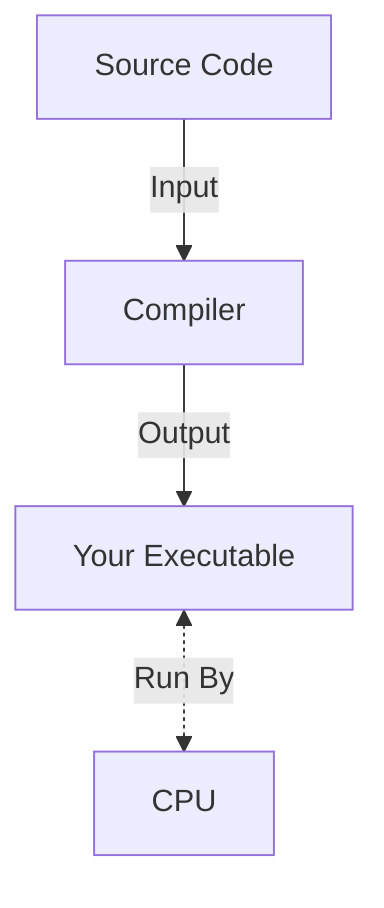
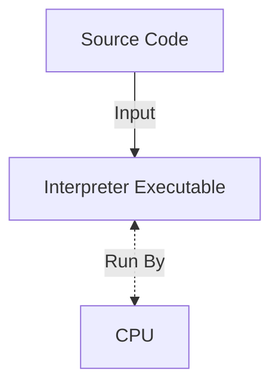

# Why is Python Slow? Compiled, Interpreted and Other Jargon

---
layout: quote
color: orange
author: ChatGPT
---

Python is often considered slow because it is an **interpreted, dynamically typed** language that prioritizes readability and flexibility over raw execution speed, adding runtime overhead compared to **compiled languages**.

---
layout: side-title
color: orange
---

:: title ::

## Why Python is Slow Part 1:

## Compiled vs Interpreted

:: content ::


---
layout: top-title-two-cols
color: orange
---

:: title ::

## From Source Code to Calculation: How Computers Work

:: left ::

<v-click at=2>

<SpeechBubble position="bl" color="sky" shape="round" maxWidth="100%">

I'm a programmer, and I speak **source code**

```python
def hello_world():
  print("Hello iCSC26!")
```

</SpeechBubble>


</v-click>

:: right ::

<v-click at=3>

<SpeechBubble position="bl" color="sky" shape="round" maxWidth="100%">

I'm a CPU, and I speak **machine code**

```sh
01010101010101010101010101011010
10101010101001010111010101010101
```

</SpeechBubble>


</v-click>

<hr style="height:10px; visibility:hidden;" />

<v-click at=4>

<Admonition title="Important!" color="amber-light" width="100%">
There is no single machine code, the language depends on your specific CPU (x86/ARM/etc...) and your OS (Windows/Linux/Mac)
</Admonition>

</v-click>

:: default ::

<v-click at=1>

### Programming languages all ultimately try to solve the same problem

</v-click>

---
layout: top-title-two-cols
color: orange
---

:: title ::

## Approach 1: Compiled Languages

:: left ::

The general idea is as follows:

- **Compilers** take in **source code** as an input, and output new **executables** filled with the **machine code** you want
- Examples of common compiled languages are C, C++, Rust, and Fortran


```bash
# Compile source code into an executable once
g++ my_code.cpp -o my_exec
# Run you machine code executable as many times as you want!
./my_exec
./my_exec
./my_exec
```
:: right ::



---
layout: top-title-two-cols
color: orange
---

:: title ::

## Approach 2: Interpreted Languages

:: left ::

The general idea is as follows:

- Instead of the language having a **compiler**, it will have an **executable** known as the **interpreter**
- The **interpreter** essentially reads your code "line-by-line", understands what you're trying to do, and asks the CPU to perform the relevant operation
- Common examples of interpreted languages are Python, JavaScript, Ruby, and Perl

```bash
# No compilation step, just run a Javascript interpreter like
node my_code.js
node my_code.js
node my_code.js
# `node` is the executable that your CPU can actually run!
```
:: right ::



---
layout: top-title
color: orange
---

:: title ::

## So, why are compiled languages faster?

:: content ::

Compiled languages are faster for two main reasons:

- They don't need to repeat compilation-like steps each time the code is run (e.g. parsing the source code, etc...)
- Because of this, they can afford to spend more time on these steps, and perform lots of optimisations

These optimisations will try to understand what your code is doing, and restructure/modify it liberally as long as it produces the same desired behaviour. Compiler optimisations often include:
- Computing compile-time constants
- Loop optimisations
- Memory and cache optimisations
- Control flow and function optimisations
- So, so much more

---
layout: side-title
color: orange
---

:: title ::

## So, What About Python?

:: content ::

ChatGPT said Python is interpreted, case closed!

<br>

This also lines up with how we've seen interpreted languages run:
```bash
# No compilation step, `python` executable as interpreter
python my_code.py
python my_code.py
python my_code.py
```

Surely there's nothing else going on, right?

---
layout: top-title-two-cols
color: orange
---

:: title ::

## The Hidden Complexity of Python (and most modern interpreted languages)

:: left ::

What we see as one simple step:
```bash
# No compilation step, `python` executable as interpreter
python my_code.py
```

Actually runs more like:
```bash
# Compilation to machine-agnostic Python bytecode
python -m py_compile my_code.py
# Interpretation of Python bytecode
python my_code.pyc
```

You may have even seen some `.pyc` files in your `__pycache__` folder before. This is so that python can reuse the bytecode and save some time (if your source files don't change).

:: right ::

<SpeechBubble position="r" color="sky" shape="round" maxWidth="100%">

- Python's compilation is not the same as C/C++/Fortran's
- It is not intensely optimising and it does not produce machine code
- It mostly acts to separate the parsing of the language from the actual execution of the instructions

</SpeechBubble>

<br>

<Admonition title="Fun Fact" color="amber-light" width="100%">
You can even "disassemble" your python code into a human-readable analogue of its bytecode with `python -m dis my_code.py`
</Admonition>

---
layout: top-title
color: orange
---

:: title ::

## So Python Is Slow Because It's Not Compiled?

:: content ::

Not quite...

- As we've covered, compiled languages are typically faster than interpreted languages like Python
- However, Python is still slower than languages with similar-seeming execution models like Java
- What is causing this additional slowness?

---
layout: side-title
color: orange
---

:: title ::

## Why Python is Slow Part 2:

## Static vs Dynamic Typing

:: content ::


---
layout: top-title-two-cols
color: orange
---

:: title ::

## Dynamic vs Statically Typed Languages

:: left ::

Languages often come in two main varieties:

Compiled languages like C/C++, Fortran, and Rust will often use **strong, static** typing

**Interpreted languages** like Python will often use weak, dynamic typing

Dynamic typing can introduce lots of overheads. To compute even a simple `x+y`, I need to:
  - Check the types of x and y
  - Check their types have a valid `+` operation defined
  - Find and execute that specification
  - All at runtime!

:: right ::

Strong, Static Typing (C++):

```c++
int x = 5; // Have to specify type (strong)
x = "Hello"; // INVALID C++! Can't change type (static)
```

Weak, Dynamic typing (Python):
```python
x = 5 # Don't need to specify type (weak)
x = "Hello" # Perfectly fine to change! (dynamic)

```

<br>

<Admonition title="Info" color="amber-light" width="100%">
This is why strongly, statically typed compiled languages are so much faster! They check all of this and make all of these decisions at compile time. This is also why they're able to give helpful errors at compile time, instead of runtime (Rust is infamous for its comprehensive compile-time errors).
</Admonition>

---
layout: side-title
color: orange
---

:: title ::

## Now we know why Python's slow, how can we make ours faster?

:: content ::


