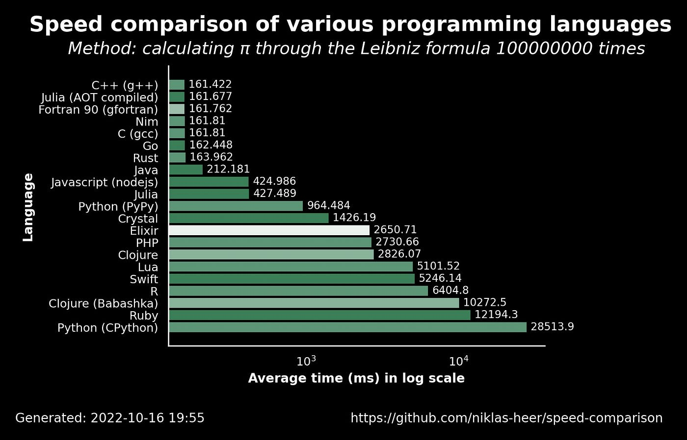

# Is Python Actually Slow? Compiled vs Interpreted and Why You Should Care

---
layout: top-title-two-cols
color: orange
---

:: title ::

## The "Python is Slow" Dogma

:: left ::

<v-click>
You've seen the memes:

<div class="grid grid-cols-2 gap-4">
<div class="grid grid-rows-2 gap-4">
  
  
</div>
  
</div>
</v-click>

:: right ::

<v-click>

And the benchmarks:



</v-click>

<br>

<v-click>

And plenty of articles, comments, opinions...

But is it true, is Python as slow as they say?

</v-click>

---
layout: side-title
color: orange
---

:: title ::

Off to the races, let's show them that Python's not that slow...

:: content ::

<iframe src="https://benjdd.com/languages/" width="80%" height="500px" />

---
layout: top-title
color: orange
---

:: title ::

## The Bad News: Pure Python is Kind of Slow

:: content ::

<v-click>

Let's get this out of the way:

</v-click>

<v-clicks>

- Most "language benchmarks" are sketchy at best (even the ones I'll show you today)
- But they don't all find Python in last place for no reason
- **Pure Python**, with the **default interpreter** (CPython), is **typically** slower than languages like C++ and Rust
- In particular, **pure Python** can be quite slow for:
  - Large or nested loops
  - Heavy numerical workloads

</v-clicks>

<br>

<v-click>

### Be honest, we've all sat waiting for a Python script at least once

</v-click>

:: right ::

---
layout: side-title
color: orange
---

:: title ::

## But how can this make sense?


:: content ::

If Python is slow, why is it the most popular language in the world for machine learning and artificial intelligence?


(Read as: the most computationally expensive thing ever)

---
layout: top-title-two-cols
color: orange
---

:: title ::

## The Good News: We Don't Really Need Pure Python

:: left ::

<v-clicks>

The super-power of Python is it's huge community of libraries, written in "fast" languages like Fortran and C/C++. Python simply acts as a user-friendly **glue language**

They let you:

</v-clicks>

<v-clicks>

- Have your compute-heavy workload handled by high-optimised compiled code
- Maintain the readability and dev speed of Python
- Benefit from decent performance without knowledge of the intimate details of performance engineering

</v-clicks>

<v-click>

**As long as you're using them properly!**

</v-click>

:: right ::

<v-click at=1>


</v-click>

<br>

<v-click>

<Admonition title="Your Time Matters!" color="amber-light" width="100%">
Trade-offs between your time and runtime are very real, a 5% speed-up isn't worth a 2x dev period!
</Admonition>

</v-click>

---
layout: top-title-two-cols
color: orange
---

:: title ::

## The Great News: With Numba, You Can Even Compile Your Python!

:: left ::

<v-clicks>

Historically, all heavy computation in Python has been handed of the lower-level compiled languages like C/C++, Fortran.

Nowadays, there's been more and more effort put into **compiling** Python itself, so that we can write native Python code and get C/C++ speed.

We've just seen how **Numba**, a **Just-In-Time (JIT) Compiler** for Python can HUGELY accelerate our code.

</v-clicks>

:: right ::

<v-click at=3>


</v-click>

<br>
<br>
<br>

<v-click>

<SpeechBubble position="r" color="sky" shape="round" maxWidth="100%">

But why does this make things faster? What even is a compiled or interpreted language?

</SpeechBubble>

</v-click>

---
layout: top-title
color: orange
---

:: title ::

## From Source Code to Calculation: How Computers Work

:: content ::

The goal in programming is always to make the computer perform some useful calculation, but how do we do this?

- Programmers usually write **source code**, human readable code in a high level language like C++ or Python
- We want to then run that code on a CPU or GPU, to get our results
- But CPUs don't understand **source code** - `print(y)` and `x=5+7` means nothing to a CPU
- CPUs only understand **machine code**, a set of 1s and 0s that correspond to a CPUs **instruction set** (literally to the voltages for the electronic components)
- **Machine code** is specific to your system (CPU type, OS, etc...) and it not human readable
- Files which contain **machine code** read to execute are called **executables** - all the terminal commands and GUI programs you use are examples of **executables**
- So how do we get there?

---
layout: top-title-two-cols
color: orange
---

:: title ::

## Approach 1: Compiled Languages

:: left ::

The general idea is as follows:

- Some very clever people have made things called **compilers**
- **Compilers** are **executables** that take in **source code** as an input, and output new **executables** filled with the **machine code** you want
- Examples of common compiled languages are C, C++, Rust, and Fortran


```bash
# Compiled your source into machine code once
g++ my_code.cpp -o my_exec
# Run you machine code executable as many times as you want!
./my_exec
./my_exec
./my_exec
```
:: right ::

<SpeechBubble position="r" color="sky" shape="round" maxWidth="100%">

- Imagine you speak English, and your CPU only speaks French
- Your **source code** is like a recipe book written in English
- The **compiler** basically acts as a translator who will translate the whole recipe book into French for you
- Now your CPU can read the translated book whenever you need it to follow a recipe!

</SpeechBubble>

---
layout: top-title-two-cols
color: orange
---

:: title ::

## Approach 2: Interpreted Languages

:: left ::

The general idea is as follows:

- Instead of the language having a **compiler**, it will have an **executable** known as the **interpreter**
- The **interpreter** essentially reads your code "line-by-line", understands what you're trying to do, and asks the CPU to perform the relevant operation
- Common examples of interpreted languages are Javascript, Ruby, and Perl

```bash
# No compilation step, just run a Javascript interpreter like
node my_code.js
node my_code.js
node my_code.js
# `node` is the executable that your CPU can actually run!
```
:: right ::

<SpeechBubble position="r" color="sky" shape="round" maxWidth="100%">

- This time, we still have our **source code**, our recipe book in English
- However, instead of translating the whole book and writing a new edition in French, the **interpreter** acts as a run-time translator
- The **interpreter** will read each of your instructions in your recipe book "line-by-line", and translate them into French as it goes along with the CPU

</SpeechBubble>

---
layout: top-title-two-cols
color: orange
---

:: title ::

## Approach 3: Hybrid Languages

:: left ::

These languages fall somewhere in the middle:

- The language has both a **compiler** and an **interpreter**
- The reason it still needs an **interpreter** is because the **compiler** doesn't actually output **machine code**, but some **intermediate language**
- The **intermediate language** is often refered to as **bytecode**, and typically isn't human readable
- The most common example of a hybrid language is Java

```bash
# Compilation of source code to bytecode
javac my_code.java
# Interpretation of bytecode by Java interpreter
java my_code
# `java` is still the executable that your CPU can actually run!
```
:: right ::

<SpeechBubble position="r" color="sky" shape="round" maxWidth="100%">

- This time, it's worth remembering that all CPUs speak slightly different languages, everything from French to Malay
- The compiler rewrites the whole recipe book into some machine-agnostic **intermediate language**, we'll call "Lingua Franca"
- The interpreter will read the "Lingua Franca" version "line-by-line" and translate the instructions to the CPU's language of choice

</SpeechBubble>

---
layout: side-title
color: orange
---

:: title ::

## So, What About Python?

:: content ::

If you've seen people complain about how slow Python is, you've probably heard them blame the fact that it's an "interpreted language"

<br>

This also lines up with how we've seen interpreted languages run:
```bash
# No compilation step, `python` executable as interpreter
python my_code.py
```

<br>

So it must be an interpreted language, right?

---
layout: top-title-two-cols
color: orange
---

:: title ::

## The Hidden Complexity of Python

:: left ::

What we see as one simple step:
```bash
# No compilation step, `python` executable as interpreter
python my_code.py
```

Actually runs more like:
```bash
# Compilation to machine-agnostic Python bytecode
python -m py_compile my_code.py
# Interpretation of Python bytecode
python my_code.pyc
```

You may have even seen some `.pyc` files in your `__pycache__` folder before. This is so that python can reuse the bytecode and save some time (if your source files don't change).

:: right ::

<SpeechBubble position="r" color="sky" shape="round" maxWidth="100%">

- Python functions very similarly to Java and other hybrid languages under the hood
- In fact, almost all modern "interpreted" languages run in some kind of hybrid format, with an intermediate representation
- These languages often just hide these complexities from the user

</SpeechBubble>

<br>

<Admonition title="Info" color="amber-light" width="100%">
This hidden compilation step is why syntax errors are caught before your program starts, which wouldn't be possible if files were truly read "line-by-line"
</Admonition>

---
layout: top-title
color: orange
---

:: title ::

## So Python Is Slow Because It's Not Compiled?

:: content ::

Not quite...

- Interpreted/hybrid languages are typically slower than compiled languages as they have to repeat the effort of translating to machine code in every single run
- However, Python is still slower than languages with similar-seeming execution models like Java
- What is causing this additional slowness?

---
layout: top-title-two-cols
color: orange
---

:: title ::

## Dynamic vs Statically Typed Languages

:: left ::

One of the main culprits of Python's slowness is its dynamic typing:

- W

:: right ::

Static typing:

```c++
int x = 5; // Have to specify type of variables
x = "Hello"; // Variables can't change type!
```

Dynamic typing:
```python
x = 5
x = "Hello" # Perfectly fine!

```
