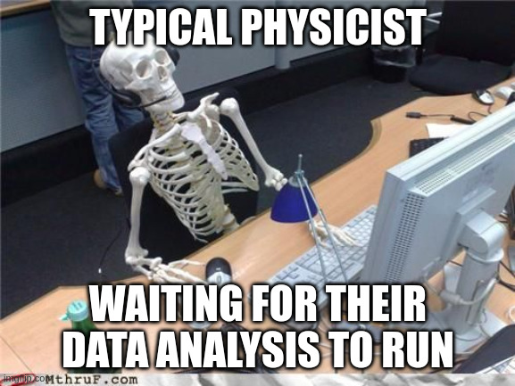
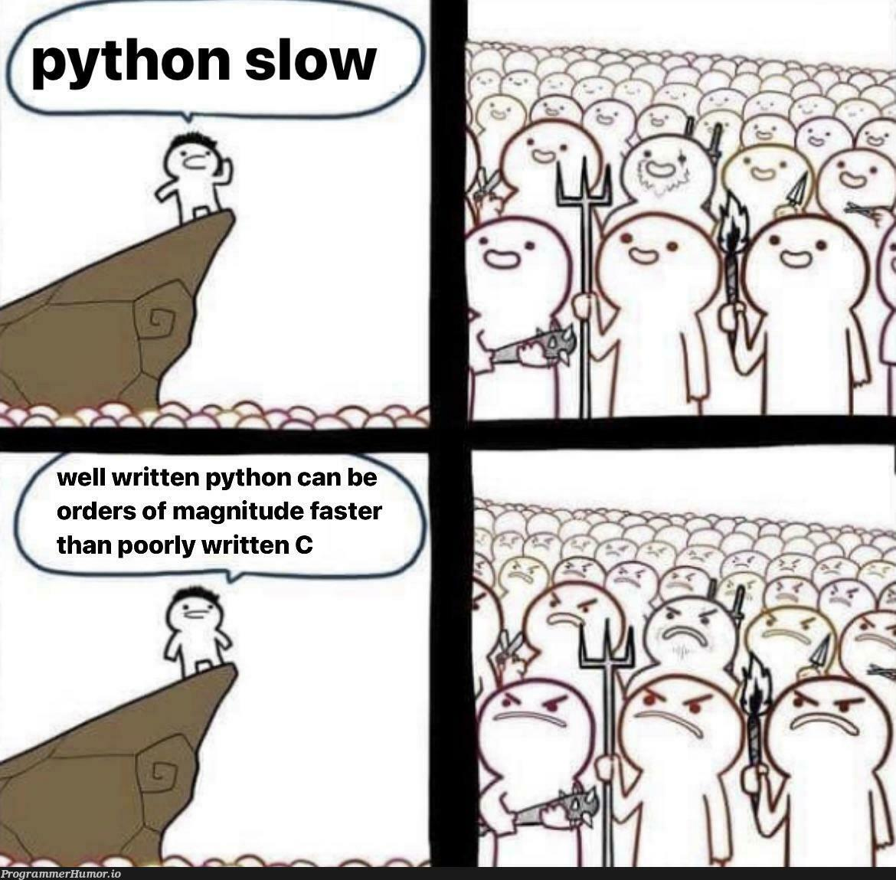

:: title ::

## Python, a programmer's best friend

:: content ::

Python is one of the most popular languages in the world, and for good reason:

<v-clicks>

- Simple, readable syntax
- Low barrier of entry
- Fast to develop in and prototype
- Extensive library support (especially for data analysis/scientific applications)

</v-clicks>

<br>
<v-click>

What more could a programmer ask for?

</v-click>

---
layout: side-title
color: sky
---

:: title ::

## Well, if you've ever found yourself in this position

<br>

## You might want to ask for speed...

:: content ::



---
layout: quote
color: sky
author: "Lots of people on the internet"
---

## "Python is slow, you should use a real language like C++ or Rust"


---
layout: top-title-two-cols
color: sky
---

:: title ::

## Speed or Ease: A Scientist's Wager

:: left ::

<v-click>

**Door 1: Python**

- Extremely fast development
- Slow run times
- Probably not suitable for high performance use cases

</v-click>

:: right ::

<v-click>

**Door 2: Compiled Languages (C/C++, Fortran, Rust)**

- Longer development times
- Lightning speed
- The usual choice where performance matters

</v-click>

:: default ::

<v-click>

### Are we always caught in this battle between dev time and run time?

<br>

</v-click>

<v-click>

### Surely there must be a better way!

</v-click>

---
layout: side-title
color: sky
---

:: title ::


## I'm here to tell you that you can have your cake and eat it too

<br>

## I'll even show you how...

:: content ::




---
layout: top-title-two-cols
color: sky
---

:: title ::

## Today's Goal: Small Changes, Big Gains

:: left ::

<v-click>

```python

def slow_python(array):
  for i in range(len(array)):
    x[i] = x[i] + 5
```

### 28.2 ms

</v-click>

<br>


:: right ::

<v-click>

```python {1,3}
@njit(parallel=True)
def fast_numba(array):
  for i in prange(len(array)):
    x[i] = x[i] + 5
```

### 96.2 ns

</v-click>

<br>

<v-click at=2>


</v-click>

:: default ::

<v-click at=3>

## You're not dreaming, that's ~300,000x speedup*

*Actual code speedup really depends on application

</v-click>

---
layout: side-title
color: sky
hideInToc: true
---

:: title ::

# Our Roadmap to Lightning Fast Python:

:: content ::

<Toc minDepth="1" maxDepth="1" />

