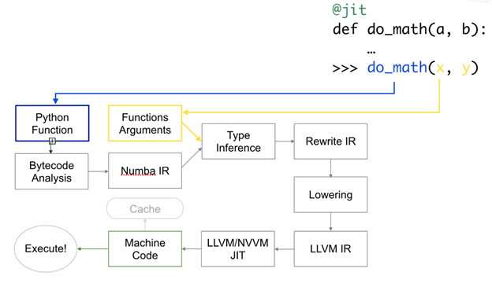
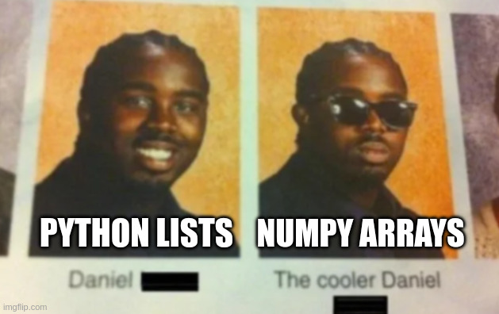

# Introducing Numba, a JIT Compiler for Python

---
layout: top-title
color: cyan
---

:: title ::

## Time To Compile Some Python!

:: content ::

<v-click>

I know I've said this whole time that Python is an interpreted language, but that's not *entirely* true:

</v-click>

<v-clicks>

- Strictly speaking, there's no such thing as a **compiled language** or an **interpreted language**
- A **language** is just a set of syntax that is mapped to some expected functionality, e.g.
  - Python's indentation
  - What `def` does
  - Even what `x=5` and `x+=5` should represent
- Anything that is able actually run on a CPU is an **implementation** of the language

</v-clicks>

<br>

<v-click>

<Admonition title="CPython is Interpreted" color="amber-light" width="100%">

When I've talked about Python so far, I've been talking about CPython

CPython is the main implementation of the Python language, the one you download off of python.org

</Admonition>

</v-click>

---
layout: top-title
color: cyan
---

:: title ::

## If Python doesn't have to be interpreted, why don't we compile it by default?

:: content ::

<v-click>

Simple answer? Compiling Python scripts as they are is very hard:

</v-click>

<v-clicks>

- Dynamic typing makes compilation difficult, and optimised compilation almost impossible
- Huge number of libraries written in different low-level languages would be hard to interface with
- Full compatibility is hard
- Python just wasn't designed for compilation

</v-clicks>

<v-click>

If it didn't require un-pythonic code changes, Python would just ship that way!

</v-click>

<br>

<v-click>

Whilst compiling **all of Python** is quite difficult, we don't need to speed up **everything**

</v-click>

---
layout: quote
color: cyan
author: Numba Website
---

Numba is an open source **JIT compiler** that translates a **subset of Python and NumPy code** into fast machine code. 

---
layout: top-title-two-cols
color: cyan
columns: is-7
---

:: title ::

## The General Idea Behind Numba

:: left ::

### What is Just-In-Time (JIT) Compilation?

- Previously, we talked about **Ahead-Of-Time (AOT) compilation**
  - The **whole program** is compiled before running
- **Just-In-Time Compilation** is quite different:
  - Code is only compiled **when it's needed**
  - Since this happens during runtime, the compiler gets extra information:
    - What types you're calling a function with
    - The CPU/hardware you're using
    - It essentially has **all** the info

:: right ::

### Why only a subset of Python/NumPy?

- Python as a whole is basically too dynamic to compile
- For science, the maths tends to be the slowest part
- Maths functions are often small, with mostly static types (`float`, `int`, etc...)

If we focus on compiling these parts of Python, it'll be easier and we can still get good speedup **(remember - prioritise!)**

---
layout: top-title-two-cols
color: cyan
columns: is-7
---

:: title ::

## How Numba Works

:: left ::

<v-click>

### Just-In-Time (JIT) Compilation:
### Compilation Right When You Need It

<br>



</v-click>

:: right ::

<v-click>

### Type Inference Example:

```python
def simple_func(x):
  y = x + 5
  return y * 2

simple_func(10) # Called with int

# Let's figure out the types
def simple_func(x): # x = 10 = int
  y = x + 5 # y = int + int = int
  return y * 2 # return = int * int = int

# Success!
```

</v-click>

<br>

<v-click>

**Since Numba can infer the types for us, we can get all the benefit without the effort!**

</v-click>
---
layout: top-title-two-cols
color: cyan
columns: is-6
---

:: title ::

## Why I Like Numba For Scientific Computing

:: left ::

<v-click at=2>

**It's easy to learn:**
- No type hinting required!
- Mostly works through simple to learn decorators

</v-click>

<v-click at=3>

**It's easy to install/distribute:**
- Simple `pip install`
- No need for compilers/new Python interpreter

</v-click>

<br>

<v-click at=1>


</v-click>

:: right ::

<v-click at=4>

**It's great for scientific use cases:**
- Supports a large set of NumPy operations
  - Numba = NumPy + Mamba (world's fastest snake)
- You only compile the functions you need to **(heavy numerics)**
  - Leave the rest of your code as plain, compatible CPython!
  - This means you can still work with unsupported libs (SciPy, AI libs, etc...)

</v-click>


---
layout: top-title-two-cols
color: cyan
---

:: title ::

## JIT-ing Your First Function

:: left ::

<v-click>

### Slow Python For Loop

```python
def my_slow_python(num_points):
  sum = 0
  for i in range(num_points):
    sum += i
  return sum
```

**XXms**

</v-click>

<br>

<v-click>

Simply import numba and add `@numba.jit` 

**(Two lines!)**

</v-click>

:: right ::

<v-click>

### Fast Numba JIT Loop

```python
import numba

@numba.jit
def my_first_jit(num_points):
  sum = 0
  for i in range(num_points):
    sum += i
  return sum
```

**XXms - XXx Speedup**

</v-click>

<br>

<v-click>

**Now that's what I call free performance!**

</v-click>

<!-- --- -->
<!-- layout: top-title-two-cols -->
<!-- color: cyan -->
<!-- --- -->
<!---->
<!-- :: title :: -->
<!---->
<!-- ## @numba.jit - A Bit More Detail -->
<!---->
<!-- :: left :: -->
<!---->
<!-- <v-click> -->
<!---->
<!-- The core feature of Numba is its `@jit` decorator: -->
<!---->
<!-- </v-click> -->
<!---->
<!-- <v-clicks> -->
<!---->
<!-- - Functions with the decorator are JIT compiled the first time they're called with certain types -->
<!-- - If they're called again with the same types, they'll reuse the existing compilation -->
<!--   - This is basically the same as calling compiled code through NumPy -->
<!-- - If you call it with different types that are incompatible, Numba will just JIT compile you a new version of the function! -->
<!---->
<!-- </v-clicks> -->
<!---->
---
layout: top-title-two-cols
color: cyan
---

:: title ::

## Aside: Decorators in Python

:: left ::

<v-click>

### Directly on Function

```python
@numba.jit
def my_first_jit(num_points):
  sum = 0
  for i in range(num_points):
    sum += i
  return sum
```

- The "normal" way of using decorators
- Best choice for your final code

</v-click>

:: right ::

<v-click>

### From Another Function

```python
def my_slow_python(num_points):
  sum = 0
  for i in range(num_points):
    sum += i
  return sum
 
my_first_jit = numba.jit()(my_slow_python)
# Don't forget the weird empty brackets!
```

- Useful for time comparisons between pure Python/Numba
- You don't have to copy/paste functions all the time to compare!

</v-click>

:: default ::

**There are also multiple ways to apply decorators in Python**

---
layout: top-title-two-cols
color: cyan
---

:: title ::

## The "JIT-Tax"

:: left ::

<v-click>

If you were to work through that last example yourself, and time it:

```python
my_first_jit = jit()(my_slow_python)
%timeit my_first_jit(1_000_000)
```

</v-click>

<v-click>

You may get a message like this:

```console
The slowest run took 477045.46 times 
longer than the fastest. 

This could mean that an intermediate 
result is being cached.
```

</v-click>

<v-click>

That's because the function is compiled the first time you call it

</v-click>

<v-click>

**Compilation is not free!**

</v-click>

:: right ::

<v-click>

This is the **"JIT-Tax"**:

</v-click>

<v-clicks>

- For small functions/small inputs, the JIT-Tax can slow you down!
- **Do not put `@numba.jit` on all of your functions, **measure** and use it selectively!**
- **JIT works best for:**
  - Functions which are slow enough to eat the JIT-Tax
  - Slow functions which you call many times in your program (JIT-Tax only strikes once!)
  - Don't trust these rules of thumb though, **measure!**

</v-clicks>


---
layout: top-title-two-cols
color: cyan
columns: is-10
---

:: title ::

## Customising Your JIT

:: left ::

<v-click>

You can customise `@jit` with flags:

</v-click>

<v-clicks>

- `nopython=True`
  - All code **must** be compiled (or error thrown)
  - Enabled by default as of Numba 0.59 **(Please only use versions >0.59 for best results!)**
- `cache=True`
  - Stores Numba's compilation for reuse between runs
  - (Saves on that JIT-Tax)
- `nogil=True` and `parallel=True`
  - More on these later...

</v-clicks>

:: right ::

<v-click>

Applying compilation flags:

</v-click>

<v-click>

### Directly on Function

```python
@numba.jit(cache=True)
def my_second_jit()
  ...
```

</v-click>

<br>

<v-click>

### From Another Function

```python
def my_slow_python()
  ...

my_second_jit = numba.jit(cache=True)(my_slow_python)
# Arguments go in those mysterious first brackets!
```

</v-click>

---
layout: top-title-two-cols
color: cyan
---

:: title ::

## A More Complex Example: Monte Carlo Pi Revisited

:: left ::

<v-click>

Previously we had two implementations:

</v-click>

<v-click>

### Naive Python **(8.75s)**:

```python
def mc_pi(n_samples):
    n_samples_inside = 0
    for i in range(n_samples):
        x = np.random.random() 
        y = np.random.random()
        if x**2 + y**2 <= 1:
            n_samples_inside += 1
    return 4 * n_samples_inside / n_samples
```

</v-click>

<br>

<v-click>

### NumPy Rewrite **(312ms)**:

```python
def mc_pi_np(n_samples):
    xs = np.random.random(n_samples)
    ys = np.random.random(n_samples)
    r_sqs = xs**2 + ys**2
    n_samples_inside = np.sum(r_sqs <= 1)
    return 4 * n_samples_inside / n_samples
```

</v-click>

:: right ::

<v-click>

How does Numba compare?

</v-click>

<v-click>

### Naive Python JIT'ed

```python
mc_pi_jit = jit()(mc_pi)
%timeit mc_pi_jit(1_000_000)
```

**256ms** (similar to NumPy)

</v-click>

<v-click>

### NumPy JIT'ed

```python
mc_pi_np_jit = jit()(mc_pi_np)
%timeit mc_pi_jit(1_000_000)
```

**406ms** (slower than NumPy)

</v-click>

<v-clicks>

You can't beat NumPy at its own game!

**But, if you hate NumPy and love For Loops, you can get the same speed with one line change (instead of full rewrites)!**

</v-clicks>

---
layout: top-title-two-cols
color: cyan
---

:: title ::

## Where Numba Really Shines: Unavoidable For Loops

:: left ::

<v-click>

### Simple Time Integration

```python
def naive_time_integral(pos_0, vel_0, dt, steps, acc=-9.81):
  pos = np.zeros(steps)
  pos[0] = pos_0
  vel = np.zeros(steps)
  vel[0] = vel_0

  for i in range(1, steps):
      vel[i] = vel[i-1] + acc * dt
      pos[i] = pos[i-1] + vel[i-1] * dt

  return pos, vel, acc
```

**3.03s**

</v-click>

<v-clicks>

We can't rewrite this as a NumPy vectorised operation, as each `i` explicitly depends on `i-1`

**Basically, we have to calculate each time step in order, not all at once!**

</v-clicks>

:: right ::

<v-click>

### JIT'ed Time Integration

```python
time_integral_jit = numba.jit()(naive_time_integral)
```

**71.6ms**

</v-click>

<v-click>

Once again, one change = **42x Speedup**


</v-click>

---
layout: top-title-two-cols
color: cyan
---

:: title ::

## And Recursive Functions!

:: left ::

<v-click>

### Naive Python

```python
def naive_fibonacci(N):
    if N <= 1:
        return N
    else:
        return naive_fibonacci(N-1) + naive_fibonacci(N-2)
```

**14.5s** for the 40th Number

</v-click>

<v-click>

### Numba JIT

```python
fibonacci_jit = numba.jit()(naive_fibonacci)
%timeit fibonacci_jit(40)
```

```sh
TypingError: Failed in nopython mode pipeline 
(step: nopython frontend)
Untyped global name 'naive_fibonacci': 
Cannot determine Numba type of <class 'function'>
```

Oh no! That's not a speedup...

</v-click>

:: right ::

<v-click>

This is a classic Numba **type inference** error:

</v-click>

<v-clicks>

- When compiling, Numba tries to **infer** what the types are and make sure they're all static
- It can't figure out the return type of `naive_fibonacci` (what we're JIT-ing) because it depends on `naive_fibonacci` (itself)

</v-clicks>

<v-click>

Even I'd find that a little confusing...

</v-click>

<br>

<v-click>

**Luckily, there's a way we can help it!**

</v-click>

---
layout: top-title-two-cols
color: cyan
---

:: title ::

## Function Signatures in Numba

:: left ::

<v-click>

I promised you that Numba would handle all of your typing for you

</v-click>

<v-clicks>

- Numba's type inference works really well, **on average**
- In certain cases, such as this one, it just needs some help

</v-clicks>

<v-click>

Don't worry, we don't need to manually specify **all the types** like in C/C++!

</v-click>

<v-click>

We only need to specify the **function signature**
- `"ReturnType(Arg1Type, Arg2Type, ...)"`

</v-click>

:: right ::

<v-click>

### Revised JIT Fibonacci

```python
fibonacci_jit = numba.jit("int64(int64)")(naive_fibonacci)
```

</v-click>

<v-click>

Now, for performance we get:
- **791ms** - That's **~18x speedup** 

</v-click>

<v-click>

You can specify the function signature for any JIT function, and can even supply multiple:
```python
fibonacci_jit = numba.jit(["int32(int32)", "int64(int64)",...])
```

</v-click>

<v-click>

<br>

<Admonition title="Specify All Signatures You Want!" color="amber-light" width="100%">

If you specify one or more function signatures, Numba will not infer new signatures! If you only specify "int64(int64)", your floats will be treated as ints!

Just make sure you put the **most specific first**
(32 bit before 64 bit, int before float, etc...)

</Admonition>

</v-click>

---
layout: top-title-two-cols
color: cyan
---

:: title ::

## Typing in Numba - A Warning

:: left ::

While we're on the topic of typing:
- Numba is quite good at guessing types
- But types actually need to be guessable

At the end of the day, Numba is **statically typed** like C/C++
- Variables should not change types in your functions
- You should always return the same type

<SpeechBubble position="l" color="sky" shape="round" maxWidth="100%">

Bonus typing tip, you can check Numba's inference with:

`your_function.inspect_types()`

</SpeechBubble>

:: right ::

Different return types like this:

```python
@jit
def different_returns(x):
    if x < 0:
        return "Oh no, negative!" # string
    else:
        return 1.5 # float

different_returns(-1)
```

Will give an error like this:
```console
TypingError: Failed in nopython mode 
pipeline (step: nopython frontend)
Can't unify return type from the following types: 
Literal[str](Oh no, negative!), float64
```


---
layout: top-title-two-cols
color: cyan
columns: is-5
---

:: title ::

## Some Performance Tips For JIT'ed Functions

:: left ::

<v-click>

**Always Use NumPy arrays!**
- They're contiguous in memory and easy for Numba to understand

</v-click>

<v-click>

### Even for Numba:

<br>



</v-click>

:: right ::

<v-click>

**Favour simple, explicit loops (opposite of NumPy, I know):**
- These are easier of Numba to understand and for LLVM to optimise

</v-click>

<v-click>

**Keep your functions small**
- Numba can inline JIT'ed functions into other JIT'ed functions

</v-click>

<v-click>

**Only use Numba where you need it**
- Only use Numba for your heaviest numerical functions
- Don't forget the JIT-Tax!

</v-click>

---
layout: top-title-two-cols
color: cyan
---

:: title ::

## Bonus: Make Your Own NumPy Universal Functions!

:: left ::

<v-clicks>

Why bother writing all these For Loops?

**All I care about is maths**

</v-clicks>

<v-click>

Isn't it cool how you can give NumPy Universal Functions (ufuncs) basically anything?

```python
x = 5.
y = np.array([1., 2., 3., 4., 5.])

# All absolutely fine!
np.divide(x, y) # scalar / array
np.divide(y, x) # array / scalar
np.divide(x, x) # scalar / scalar
np.divide(y, y) # array / array
```

</v-click>

<v-click>

In my opinion, they're one of NumPy's coolest features

</v-click>

<v-click at=8>

<SpeechBubble position="l" color="sky" shape="round" maxWidth="100%">

You even get all the <Link to="https://numpy.org/doc/stable/reference/ufuncs.html#ufunc" title="usual NumPy ufunc features" /> like reductions, accumulations, etc...

</SpeechBubble>

</v-click>

:: right ::

<v-click>

With Numba, you can define your own custom ufuncs using `@vectorize`:

```python
@vectorize("float64(float64, float64)")
def safe_divide(x, y):
    if y == 0.:
        return 0.
    else:
        return x/y

x = 5
y = np.array([0,1,2,3,4,5])

safe_divide(x, y) # [0., 5., 2.5, 1.66666667, 1.25, 1.]
```

</v-click>

<v-clicks>

Yes, unfortunately **function signatures** are required again, but this really lets you focus on the maths!

All you need to do is write the **per element equation**

</v-clicks>

---
layout: quote
color: cyan
author: You, Probably
---

Zero effort and insane performance?

<br>

This sounds too good to be true...

---
layout: top-title
color: cyan
---

:: title ::

## Things That Don't Work So Well

:: content ::

<v-click>

Numba is amazing when applied to heavy **numerical workflows**, but less amazing for other things:

</v-click>

<v-clicks>

- **It isn't compatible with most libraries outside of NumPy**
  - Even though it can't JIT other libraries, since you only JIT some functions you can still use them in the same codebase!
- **It doesn't even support all of NumPy**
  - (But it does support basically everything you'll care about)
  - <Link to="https://numba.readthedocs.io/en/stable/reference/numpysupported.html" title="The Numba docs cover this really well" />
- **It doesn't work for string manipulation, I/O, etc...**
- **Class/object support isn't perfect**
  - `self` is a Python Object that Numba doesn't understand, so `@numba.jit` can't be applied to class methods directly

</v-clicks>

---
layout: top-title-two-cols
color: cyan
---

:: title ::

## Aside: Working With Classes In Numba

:: left ::

<v-click>

### Before JIT, Typical Class

```python
class Circle:
  def __init__(self, radius):
    self.radius = radius

  def area(self): # Pesky `self` that Numba can't handle
    return np.pi * self.radius**2
```

*Please pretend area is a heavy, expensive function*

</v-click>

<v-click>

`self` references are a problem for Numba, so we need to eliminate them

</v-click>

<v-click at=6>

<SpeechBubble position="l" color="sky" shape="round" maxWidth="100%">

There's also an experimental `@jitclass`, which not only compiles class functions but treats classes like C-style structs!

</SpeechBubble>

</v-click>

:: right ::

<v-click>

### After JIT, Heavy Functions Offloaded

```python
class JITCircle:
  def __init__(self, radius):
    self.radius = radius

  def area(self):
    return _calc_area(self.radius) # Pass in required args

  @numba.jit # `@jit` must be first!
  @staticmethod # Doesn't require self reference
  def _calc_area(radius):
    return np.pi * radius**2
```

</v-click>

<v-click>

`@staticmethod` is an option if you still want the function in the class

</v-click>

<v-click>

You can also keep your helper function outside of the class

</v-click>

---
layout: side-title
color: cyan
---

:: title ::

## Section Summary

:: content ::

<v-click>

### In this section we have learnt:

</v-click>

<v-clicks>

- Python doesn't have to be interpreted
  - Numba is a Just-In-Time (JIT) Compiler for numerical Python and a subset of NumPy
- When Numba can improve performance
  - Perfect for expensive numerical loops
  - Remember - don't JIT everything, the JIT-Tax is real **(measure!)**
- How to use Numba
  - The `@numba.jit` decorator
  - Creating ufuncs with `@numba.vectorize`

</v-clicks>

