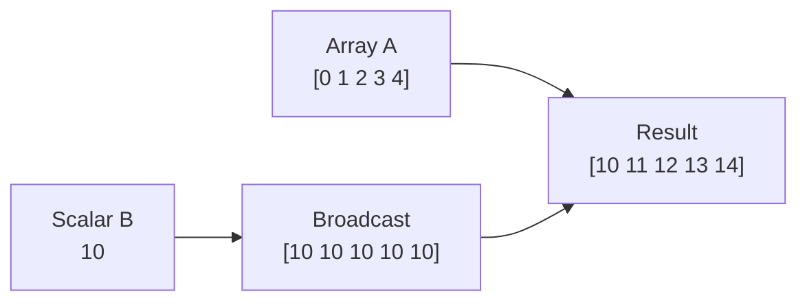
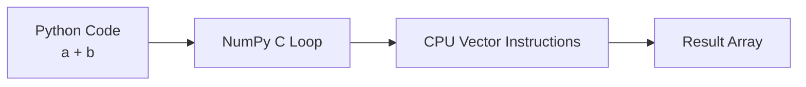
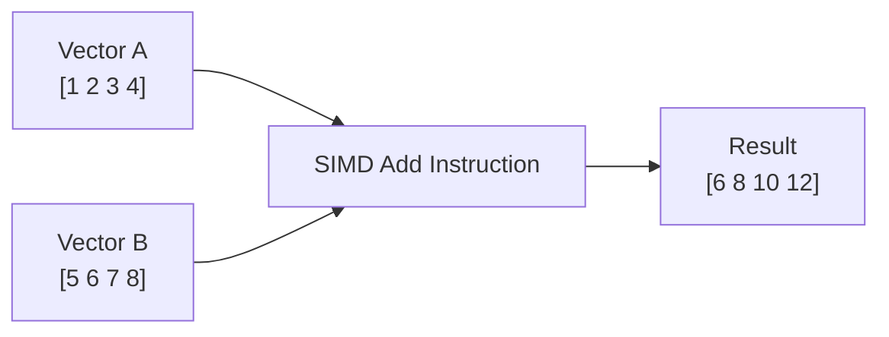
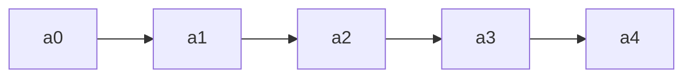
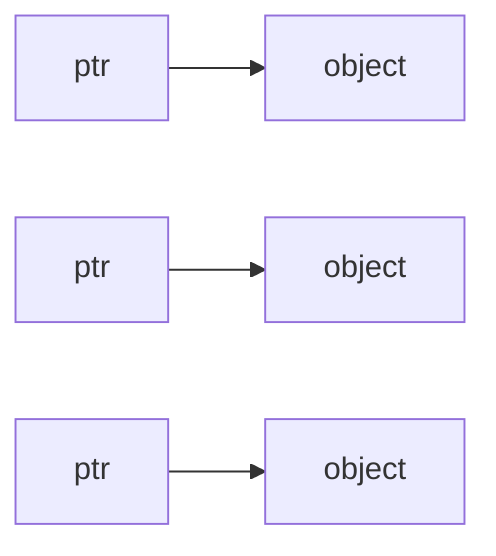
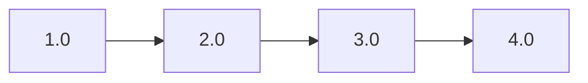
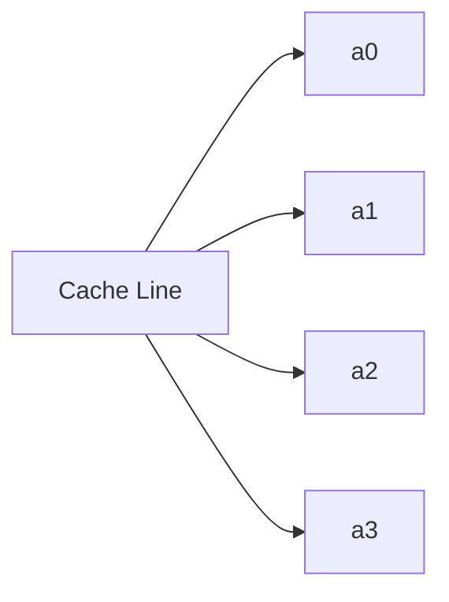

# Numerical Optimisations Pt 1: Offloading to NumPy

---
layout: top-title-two-cols
color: yellow
---

:: title ::

## NumPy: a Scientist's Best Friend

:: left ::

NumPy is THE package for numerical/scientific computing in Python.

It's incredibly fast, with a mostly C/C++ backend, and provides features like:
- Efficient, flexible N-dimensional arrays
- Comprehensive vector/linear algebra operations
- Useful statistics functions
- Great random number generation

:: right ::


---
layout: top-title
color: yellow
---

:: title ::

## NumPy Should Always Be Your First Choice

:: content ::

Let's make this perfectly clear:

- This talk is about Numba, but that's not my first choice for optimisation
- I will **ALWAYS** check that I'm properly using NumPy before reaching for Numba
- NumPy is written in C/C++ and has very little overheads
- It's also written by some amazingly talented programmers
- If NumPy can do it already, you almost certainly can't do it better
- Even if you do need Numba, Numba and NumPy work amazingly together!

<br>

**So let's have a quick refresher on how to make the most of NumPy!**

---
layout: top-title-two-cols
color: yellow
columns: is-5
---

:: title ::

## Rule 1: Lists Are Dead to You 

:: left ::

### Python lists

```python
x_list = [1, 2.4, 3, 7] 

x_list.append("Hello") # Fine and cheap
```

- Each number is stored as a bloated `PyObject`
- Memory is discontiguous (the objects are all over the place in memory)
- This is done so that you can easily append to lists, and so that it can contain different types

:: right ::

### NumPy arrays

```python
x_array = np.array([1,2.4,3,7])
# or
x_array = np.array(x_list)
# x_array = [1.  2.4 3.  7. ] (NumPy chose float)

x_array = np.append(x_array, 'Hello') # Expensive!
# Now x_array = ["1", "2.4", "3", "7", "Hello"] (all strings!)
```

- NumPy manages the memory for you
- It's stored as a strongly-typed, contiguous c-style array
- NumPy will automatically determine the common datatype (`float32`, `float64`, `int64`, `string`, etc...)
- You can check what it has infered with `x_array.dtype`

**I never want to see `np.sin(x_list)` - use an array!**

---
layout: top-title-two-cols
color: yellow
---

:: title ::

## Rule 2: For Loops Are Out of Style

:: left ::

### For loops

```python
x_list = [1,2,3,4,5]
y_list = [6,7,8,9,10]

for i in range(len(x_list)):
  x_list[i] += 5

for i in range(len(x_list)):
  x_list[i] = math.sin(x_list[i])

for i in range(len(x_list)):
  x_list[i] += y_list[i]
```

- Verbose, harder to read
- For loop is happening in Python itself (death of all performance)

:: right ::

### NumPy vectorised array operations

```python
x_array = np.array(x_list)
y_array = np.array(y_list)

x_array += 5 # Yes, this does the whole array all at once

x_array = np.sin(x_array) # Yes, this one does too!

x_array += y_array # This is a element-wise vector addition!
```

- Clean and readable syntax (lets you focus on the maths)
- For loop is happening under the hood in C/C++ (much faster, vectorised operation)

**With NumPy, you always want to see operations on arrays, not elements**

---
layout: top-title-two-cols
color: yellow
---

:: title ::

## Rule 3: Be Lazy, Use NumPy's Built-In Functions!

:: left ::

### Hand-coded

```python
sum = 0
for x in x_list:
  sum += x
n_elems = len(x_list)
mean = sum / n_elems
```

- Hand-coded functions are prone to typos/errors
- Need to remember the formula for all your favour statistics
- Slow Python for loop (again)

:: right ::

### NumPy built-in

```python
mean = x_array.mean() # Just beautiful!
```

- No errors in sight!
- Immediately readable
- Lightning-fast, optimised implementations

**NumPy has ~2000 contributors and has been worked on for decades. If it can do it, you can't do it better/faster!**

---
layout: top-title-two-cols
color: yellow
---

:: title ::

## Rule 4: Nd Arrays Are Cool!

:: left ::

### Python Lists of Lists

```python
  x_list = [[1, 2], [3,4]]
  x_list[0][1] # 2
  # Multiple layers of indices
```

- Ugly and confusing
- No guarantee the internal lists will be the same length (for matrices, tensors, etc...)

:: right ::

### NumPy 2d Array

```python
x_array = np.array(x_list)
x_list[0,1] # 2
# Native multi-indexing

x_list[:,1] # [2,4]
# Able to slice over multiple rows!
```

- More closely resembles maths (but still 0-indexed)
- NumPy's array slicing is just *chef's kiss*

**NumPy is built for vector maths/linear algebra from the ground up**

---
layout: top-title-two-cols
color: yellow
---

:: title ::

## NumPy's Performance Gains

:: left ::

:: right ::

---
layout: top-title
color: yellow
---

:: title ::

## The (Very Few) Places NumPy Falls Short

:: content ::

---
layout: top-title
color: yellow
---

<Link to="numpy-tips" title="Bonus NumPy Tips and Tricks" />


---

# Writing Fast Scientific Code with NumPy

Practical tips first  
Then: why they work

---

# The Key Idea

Slow scientific Python often looks like this:

```python
result = []
for i in range(len(a)):
    result.append(a[i] * b[i])
````

Fast NumPy code looks like this:

```python
result = a * b
```

Rule of thumb:

> **Operate on arrays, not elements**

---

# Practical Tip 1: Avoid Python Loops

❌ Python loop

```python
c = np.empty(len(a))

for i in range(len(a)):
    c[i] = a[i] + b[i]
```

✅ NumPy vectorized operation

```python
c = a + b
```

Advantages:

* fewer Python instructions
* optimized C implementation
* enables SIMD instructions

---

# Practical Tip 2: Use Broadcasting

Broadcasting applies operations across arrays automatically.

```python
a = np.arange(5)
b = 10

result = a + b
```

Conceptually:

```text
[0 1 2 3 4]
+
[10 10 10 10 10]
```

But NumPy **does not actually copy the data**.

---

# Broadcasting Example



Broadcasting avoids loops **and** avoids extra memory.

---

# Practical Tip 3: Preallocate Arrays

Avoid repeated allocations.

❌ Slow

```python
arr = np.array([])

for i in range(10000):
    arr = np.append(arr, i)
```

✅ Faster

```python
arr = np.empty(10000)

for i in range(10000):
    arr[i] = i
```

Allocate memory **once**, then fill it.

---

# Practical Tip 4: Use NumPy Built-ins

Many NumPy functions call highly optimized libraries.

Examples:

```python
np.sum(a)
np.mean(a)
np.dot(a, b)
np.linalg.solve(A, b)
```

These often use optimized BLAS implementations.

---

# Summary So Far

Fast NumPy code:

* Avoid Python loops
* Use vectorized operations
* Use broadcasting
* Preallocate arrays
* Prefer built-in NumPy functions

Now the question:

> **Why are these operations so fast?**

---

# Why NumPy Is Fast

Three major reasons:

1. **Vectorization**
2. **SIMD instructions**
3. **Contiguous memory layout**

These allow the CPU to process large arrays efficiently.

---

# Vectorization

Vectorization means applying one operation to **many values at once**.

Instead of:

```python
for i in range(n):
    c[i] = a[i] + b[i]
```

NumPy internally performs something like:

```
vector_add(a, b)
```

The loop happens **inside compiled C code**, not Python.

---

# Vectorized Execution



This removes Python overhead and allows low-level optimizations.

---

# SIMD: Single Instruction Multiple Data

Modern CPUs can process multiple numbers **in a single instruction**.

Example:

```
a = [1 2 3 4]
b = [5 6 7 8]
```

Instead of:

```
1+5
2+6
3+7
4+8
```

SIMD can compute:

```
[1 2 3 4] + [5 6 7 8]
```

in **one CPU instruction**.

---

# SIMD Concept



NumPy operations can leverage these instructions internally.

---

# Contiguous Memory

NumPy arrays store data in **continuous blocks of memory**.



Advantages:

* fast sequential access
* efficient CPU caching
* easy SIMD loading

---

# Python Lists vs NumPy Arrays

Python list memory:



NumPy array memory:



Lists store **pointers to objects**.
NumPy stores **raw numeric data**.

---

# Cache Locality

CPUs read memory in **cache lines (~64 bytes)**.

Contiguous arrays allow the CPU to fetch many values at once.



This dramatically improves performance.

---

# Final Takeaways

Practical rules:

1. Think in **arrays**
2. Avoid **Python loops**
3. Use **vectorized operations**
4. Use **broadcasting**
5. Prefer **NumPy built-ins**

These work because NumPy leverages:

* SIMD
* contiguous memory
* compiled loops

---

# Thank You

Questions?

```
```

