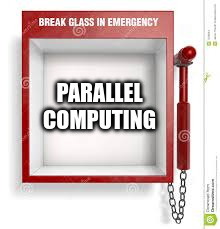
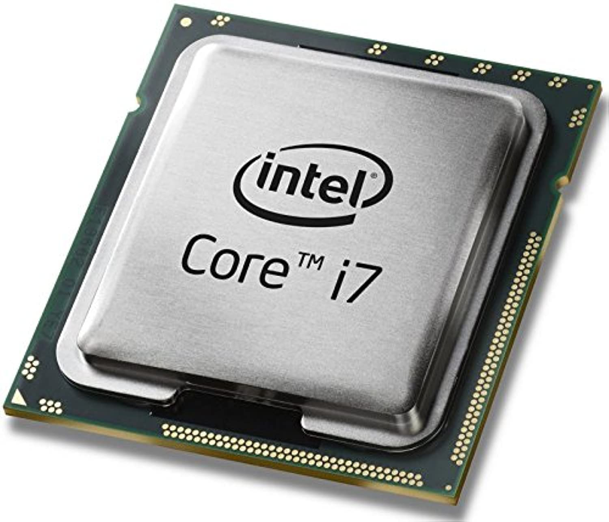
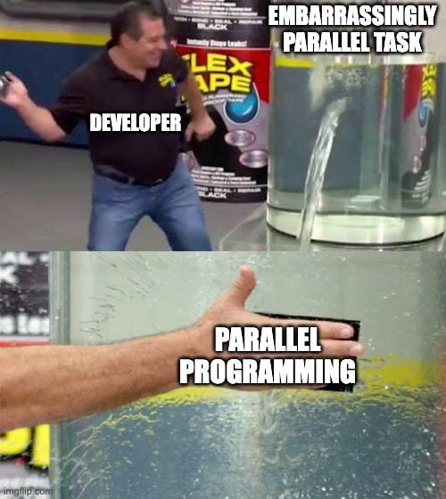
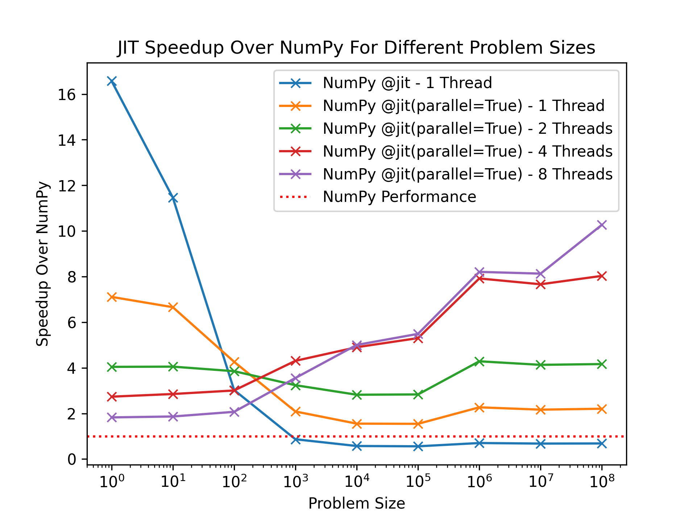
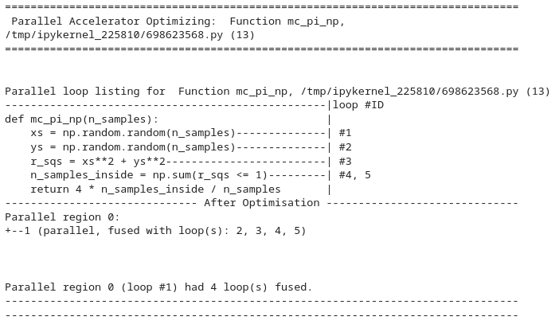

# Going Beyond JIT: Numba for Parallel Programming

---
layout: top-title-two-cols
color: indigo
columns: is-8
---

:: title ::

## What Do We Do When NumPy/Numba isn't enough?

:: left ::

<v-click>

So far, we've learnt how to optimise Python code with NumPy and Numba
- We often find that their performance is quite similar
- This makes sense, the compiled code ends up looking almost identical

</v-click>

<v-click>

What happens if you follow every step in this talk, you profile your code, and it's still 80% a nice NumPy/Numba function?

</v-click>

<v-click>

- Is it finally time to concede and break out the C++?

</v-click>

<br>

<v-click>

### **Absolutely not!**

</v-click>

:: right ::

<v-click at=4>



</v-click>

---
layout: top-title-two-cols
color: indigo
columns: is-8
---

:: title ::

## Parallel Computing, Our Saviour

:: left ::

<v-clicks>

We've been running optimised machine code, but only **serial code**:
- **Serial** execution = perform each instruction **one after another**
- Basically, 1 CPU core has been doing all the work!

Modern CPUs will have more than 1 core:
- My laptop has 10 cores, most have at least 4
- This is before we even mention the "GPU" word
- If the power is there, why not use it? 

That's where **parallel computing** comes in:
- **Parallel** execution = perform instructions **at the same time**
- Instead of 1 core doing all the work, you distribute it!

</v-clicks>

:: right ::

<v-click at=3>




</v-click>

<v-click at=4>


</v-click>

---
layout: top-title
color: indigo
---

:: title ::

## Numba and Parallel Computing

:: content ::

<v-click>

Numba was built with parallelism in mind, and provides a few ways you can go about it:

</v-click>

<v-clicks>

- **OS** Thread-based parallelism for CPUs (not Python threads - no GIL!)
  - Thread-based parallelism is SIMD where work is shared across multiple threads ($\approx$ CPU cores)
    - Since each thread can still do SIMD vector operations, you can think of Numba as SIMD$^2$
  - It's simple to use too:
    - JIT compiling functions with `@jit(parallel=True)`
    - Using `@vectorize(target="parallel")`
- You can also write GPU kernels with Numba's CUDA support
  - This is really cool, and the only way you can write CUDA kernels in **pure python**
  - Sadly, we won't have time to get into this today

</v-clicks>

---
layout: side-title
color: indigo
---

:: title ::

## **Let's parallelise some Python!**

:: content ::



---
layout: top-title-two-cols
color: indigo
---

:: title ::

## JIT-ing Our First Function With parallel=True

:: left ::

<v-click>

### Nice, NumPy Vectorized Code

```python
def np_sin2(x):
    return np.sin(x)**2
```

**66.8ms**

</v-click>

<br>

<v-click>

### Serial JIT Version

```python
np_sin2_jit = numba.jit()(np_sin2)
```

**69.5ms** (very similar)

</v-click>

<br>

<v-click>

Luckily, Numba can parallelise a lot of NumPy's array operations, ufuncs, and other functions!

</v-click>

:: right ::


<v-click>

It's as simple as adding the `parallel=True` flag

### Parallel JIT Version

```python
np_sin2_jit = jit(parallel=True)(np_sin2)
```

</v-click>

<v-click>

**19.7ms** on 4 threads

That's about a **3.4x Speedup**, once again for minimal effort!

</v-click>

<br>

<v-click>

<SpeechBubble position="r" color="sky" shape="round" maxWidth="100%">

**If** your data is big enough, parallelising NumPy code is **one of the few good reasons to JIT compile it**

</SpeechBubble>

</v-click>

---
layout: top-title-two-cols
color: indigo
---

:: title ::

## Numba pranges - Your Own Parallel For Loops!

:: left ::

<v-click>

### Naive Python For Loop

```python
def python_sin2(x):
    sin2 = np.empty(len(x))

    for i in range(len(x)):
        sin2[i] = np.sin(x[i])**2

    return sin2
```

**6.32s**

</v-click>

<v-click>

Once again, we apply `@numba.jit(parallel=True)`

</v-click>

:: right ::

<v-click>

### Numba Parallel `prange`

```python
@numba.jit(parallel=True)
def python_sin2(x):
    sin2 = np.empty(len(x))

    for i in numba.prange(len(x)): # range -> prange
        sin2[i] = np.sin(x[i])**2

    return sin2
```

**20.1ms** on 4 threads - **~314x Speedup**

</v-click>

<v-click>

We also have to swap our `range()` for a `numba.prange`

- This tells Numba that the loop is safe to parallelise
- It then divides the range across the threads for computation!

</v-click>

---
layout: top-title-two-cols
color: indigo
---

:: title ::

## Caution - Numba Can't Save You From Race Conditions!

:: left ::

<v-click>

Sadly, we haven't had time to go over parallel theory

</v-click>

<v-click>

- That's its own lecture series!

</v-click>

<v-click>

**One thing I have to warn you about though is race conditions!**

</v-click>

<v-click>

Take this code here:

```python
@numba.jit(parallel=True)
def race_array():
  array = np.zeros(100)
  for i in prange(len(array)):
      array[0] += 1 # Multiple loop iterations modify array[0]
  return array[0]
```

</v-click>

<v-click>

It's incredibly dangerous, and can give you **hard to reproduce, annoying bugs!**

That's because it includes a **race condition**

</v-click>

:: right ::

<v-click>

The simple instruction `array[0] += 5`

</v-click>


<v-click>

Looks more like:
```sh
read array[0]
add array[0],5
write array[0]
```

</v-click>

<v-click>

**If multiple threads do this on the same element, at the same time, they may happen out of order and give you different answers!**

</v-click>

<br>

<v-click>

### Golden rule for race conditions:

**Separate iterations of a `prange` should never access the same array element!**

</v-click>

---
layout: top-title-two-cols
color: indigo
---

:: title ::

## But It Can Do Automatic Reductions!

:: left ::

<v-click>

Take a function like this:

```python
@numba.jit(parallel=True)
def simple_reduction(array):
  sum = 0
  for i in numba.prange(len(array)):
    sum += array[i] # Numba can handle reductions into scalars!
  return sum
```

</v-click>

<v-click>

Naively, each thread accumulating into `sum` should create a race condition!

</v-click>

:: right ::

<v-click>

Luckily, Numba handle's common reductions for us:

</v-click>

<v-clicks>

- It can see you're reducing into a scalar
- Each thread will store its own copy
- They'll be combined at the end in a thread-safe manner

</v-clicks>

<br>

<v-click>

<Link to="https://numba.readthedocs.io/en/stable/user/parallel.html#explicit-parallel-loops" title="You can find out exactly what operations are/aren't supported in Numba's docs!" />

</v-click>

---
layout: top-title-two-cols
color: indigo
---

:: title ::

## Our Very Own ufunc - Now Faster!

:: left ::

<v-click>

### Original ufunc

```python
@vectorize("float64(float64, float64)")
def safe_divide(x, y):
    if y == 0.:
        return 0.
    else:
        return x / y
```

</v-click>

<v-click>

We can take our ufunc and add `target="parallel"` to the `@vecotrize` decorator

</v-click>

<v-click at=4>

This takes us from **19.2ms**

</v-click>

:: right ::

<v-click>

### Parallel ufunc!

```python
@vectorize("float64(float64, float64)", target="parallel")
def safe_divide(x, y):
    if y == 0.:
        return 0.
    else:
        return x / y
```

</v-click>

<v-click at=5>

To **29.7ms**

</v-click>

<v-click at=6>

**That's actually slower!**

In some cases, thread overheads actually slow you down - yet another lesson in **measure, measure, measure**

</v-click>


---
layout: top-title-two-cols
color: indigo
---

:: title ::

## Monte Carlo Pi Revisited: A New Champion

:: left ::


<v-click>

Previously we had two implementations:

</v-click>

<v-click>

### Naive Python:

```python
def mc_pi(n_samples):
    n_samples_inside = 0
    for i in numba.prange(n_samples): # Now a prange!
        x = np.random.random() 
        y = np.random.random()
        if x**2 + y**2 <= 1:
            n_samples_inside += 1
    return 4 * n_samples_inside / n_samples
```

</v-click>

<v-click>

### NumPy Rewrite:

```python
def mc_pi_np(n_samples):
    xs = np.random.random(n_samples)
    ys = np.random.random(n_samples)
    r_sqs = xs**2 + ys**2
    n_samples_inside = np.sum(r_sqs <= 1)
    return 4 * n_samples_inside / n_samples
```

</v-click>

:: right ::

<v-click>

Both of these work with `@jit(parallel=True)`!

The naive Python version just needs a `prange` added!

</v-click>

<v-click>

Final performance rankings:

| | **Python** | **NumPy** |
|-|-|-|
| No JIT | 4.15s | 103ms |
| `@jit` | 124ms | 147ms |
| `@jit(parallel=True)` | ==**13ms**== | ==**12.9ms**== |

</v-click>

<v-click>

**Parallel versions are joint winners! We finally beat NumPy at its own game!**

</v-click>

---
layout: top-title-two-cols
color: indigo
columns: is-7
---

:: title ::

## Monte Carlo Pi: Performance Deep Dive

:: left ::

<v-click>



Below the dotted red line is slower than pure NumPy, above is faster!

</v-click>

:: right ::

<v-click>

Some observations:

</v-click>

<v-clicks>

- **Problem size matters, always measure!**
- Make sure your performance tests are representative of your use case!
- Simple `@jit` is best for small problems
- `parallel=True` shines for large problems

</v-clicks>

<v-click>

Why is `parallel=True` with 1 thread always faster than NumPy? A normal `@jit` (which also uses 1 thread) isn't?

</v-click>

---
layout: top-title-two-cols
color: indigo
---

:: title ::

## Numba's Parallel Optimisations - Loop Fusion Is Back!

:: left ::

<v-click>

Numba's parallel version with 1 thread is faster than Numba's simple `@numba.jit`, because it is compiled differently:

</v-click>

<v-clicks>

- Functions with `parallel=True` go through Numba's **additional optimisation step**
- This includes extra compiler optimisations, e.g.:
  - **Loop Fusion!**


</v-clicks>


<v-click>

Our NumPy Monte Carlo had lots of easy gains:
- 5 duplicated loops!
- 4 intermediate arrays that could just be loops!

</v-click>

<v-click>

**The optimisation saves on memory and runtime!**

</v-click>

:: right ::

<v-click>

We can ask Numba for some info on its optimisation:
```python
mc_pi_np_jit_par.parallel_diagnostics(level=1)
```

</v-click>

<v-click>

At level 1 (least verbose), you'll get:



We can see that it manages to fuse all loops/array operations!

</v-click>

---
layout: top-title-two-cols
color: indigo
columns: is-5
---

:: title ::

## Final Comments On Performance and Safety

:: left ::

<v-click>

### Performance

</v-click>

<v-clicks>

- The jump from NumPy to `@jit(parallel=True)` is modest, and never more than your CPU count!
- The real gains come going from Python to serial NumPy/Numba!
- Only use parallel computing when you need it:
  - Make sure you **measure**
  - **And make sure you measure with different thread counts/problem sizes!**

</v-clicks>

:: right ::

<v-click>

### Safety

</v-click>

<v-clicks>

- We didn't have time for parallel theory
  - I feel like I've given you a weapon without a safety!
- **If you've done parallel computing before:**
  - <Link to="https://numba.readthedocs.io/en/stable/user/parallel.html" title="Numba's docs have the details you need" />
- **If you haven't:**
  - Be careful, parallel bugs are the worst as they don't **always** happen
  - For safety, stick to parallelising NumPy functions, loops only over `array[i]`, and simple reductions!
- **Make sure you test your code!**

</v-clicks>

---
layout: side-title
color: indigo
---

:: title ::

## Section Summary

:: content ::

<v-click>

In this section we have learnt:

</v-click>

<v-clicks>

- Numba supports parallelism in many different ways:
  - With `@jit(parallel=True)`
  - With `@vectorize(target="parallel")`
  - With cool CUDA stuff (that we didn't get to cover)
- Within its parallelism, Numba can:
  - Automatically parallelise NumPy functions
  - Parallelise our own `prange`s
  - Perform simple reductions automatically
- But, we should only resort to parallelism when we **absolutely need it**
- As always, **measure and test!**

</v-clicks>

