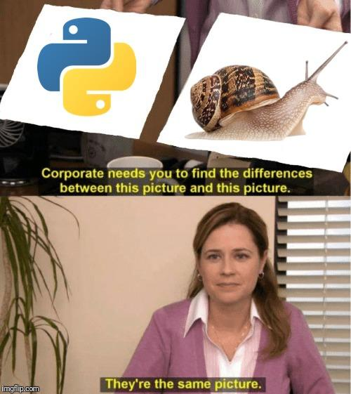
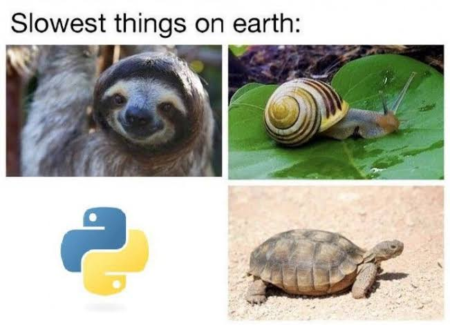
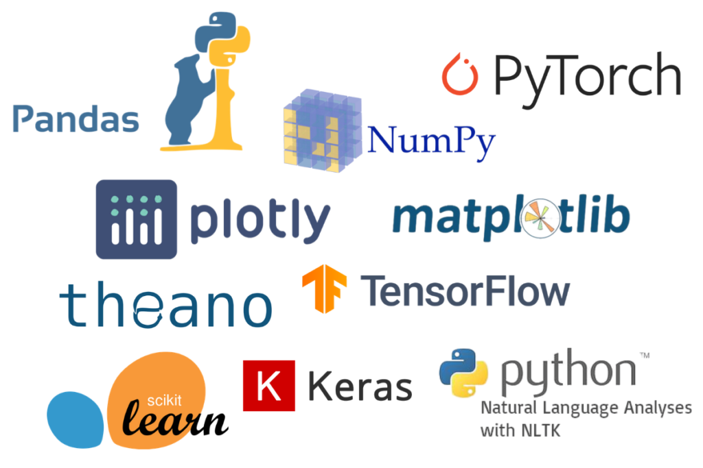

# Myth Busting: How Slow is Python, Really?

---
layout: top-title
color: red
---

:: title ::

## Python, a programmer's best friend

:: content ::

Python is one of the most popular languages in the world, and for good reason:

<v-clicks>

- Simple, readable syntax
- Low barrier of entry
- Fast to develop and prototype
- Extensive library support (especially for data analysis/scientific applications)
- Easy to share and distribute code across platforms

</v-clicks>

 
<v-click>

What more could a programmer ask for?

</v-click>

---
layout: quote
color: red
author: "Lots of people on the internet"
---

## "Python is slow, you should use a real language like C++ or Rust"

---
layout: top-title-two-cols
color: red
---

:: title ::

## The "Python is Slow" Dogma

:: left ::

<v-clicks>

- You've seen the memes
- You've seen the performance graphs
- You've seen articles and comments from C++/Rust evangelists

</v-clicks>

<v-click>
But is true? Is Python really that slow?
</v-click>

<Tweet url="https://x.com/BenjDicken/status/1861072804239847914"/>

<v-click at=3>
<iframe
  src="https://jakevdp.github.io/blog/2014/05/09/why-python-is-slow/"
  class="w-full h-[200px] rounded-lg border"
></iframe>
</v-click>

:: right ::

<v-click at=1>

  
  

  

</v-click>

---
layout: top-title-two-cols
color: red
---

:: title ::

## The Bad News: Pure Python is Kind of Slow

:: left ::

:: right ::

---
layout: side-title
color: red
---

:: title ::

## But how can this make sense?

:: content ::

If Python is slow, why is it the most popular language in the world for machine learning and artificial intelligence?

(AKA one of the most computationally expensive activites on the planet)

---
layout: top-title-two-cols
color: red
---

:: title ::

## The Good News: We Don't Really Need Pure Python

:: left ::

The super-power of Python is it's huge community of libraries, written in "fast" languages like Fortran and C/C++.

They let you:
- Have your computationally intensive operations be handled by highly-optimised libraries
- Maintain the readability and dev speed of Python
- Benefit from great performance without knowledge of the intimate details of performance engineering

**As long as you're using them properly!**

:: right ::

